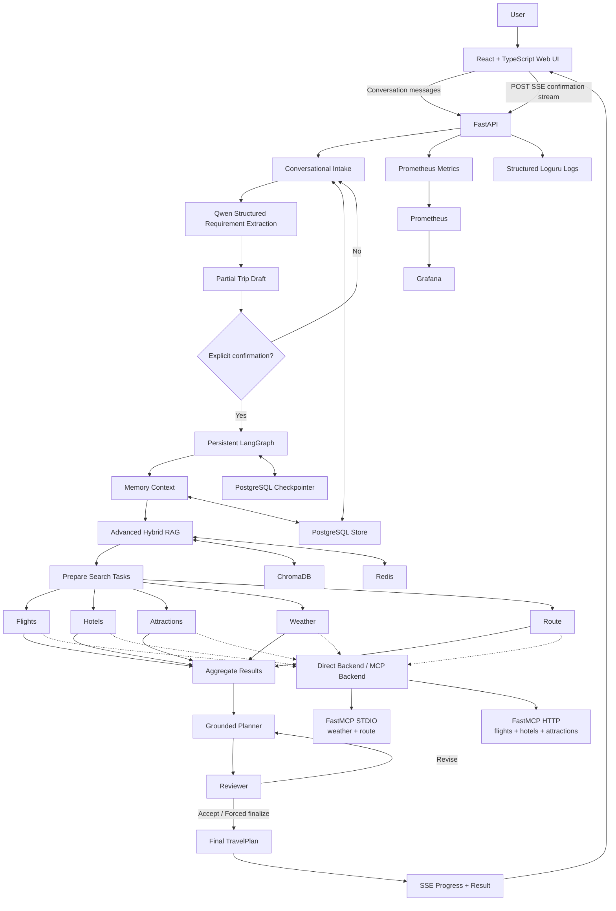

# AI Travel Planning Agent

> A full-stack, stateful multi-agent travel planning system that turns a natural-language conversation into a grounded, reviewed itinerary using LangGraph orchestration, Qwen reasoning, hybrid RAG, parallel travel-search agents, MCP tools, persistent memory, SSE progress streaming, and a React web interface.

---

## Overview

**AI Travel Planning Agent** is an end-to-end AI application designed and built as a complete travel-planning workflow rather than a single chat completion.

A user can describe a trip in ordinary language, refine incomplete requirements over multiple turns, explicitly confirm the final trip profile, and then watch the planning workflow execute in real time. The backend retrieves relevant travel knowledge, runs five travel-search branches in parallel, uses grounded Qwen reasoning to select and organize candidates, reviews the resulting plan, revises it when necessary, persists thread state and user-approved preferences, and streams progress to a responsive React frontend.

The current system is intentionally engineered around a strict boundary:

**LLMs reason; application code owns facts, validation, state, execution, and safety.**

Qwen is therefore allowed to reason over supplied candidates and produce structured decisions, but it cannot invent authoritative flight prices, hotel prices, weather observations, routes, or booking inventory. Final travel facts are assembled from validated application-owned domain objects.

---

## Current Status

The project has completed **P00–P16**.

| Area | Current state |
| --- | --- |
| Backend | FastAPI + LangGraph |
| Conversational intake | Multi-turn natural-language requirement collection |
| LLM reasoning | Real Alibaba Cloud Qwen mode + deterministic offline mode |
| RAG | Sentence Transformer + BM25 + RRF + deterministic reranking |
| Parallel search | Five LangGraph `Send` branches |
| Tool protocol | FastMCP over STDIO + Streamable HTTP |
| Persistence | PostgreSQL checkpoints + PostgreSQL Store |
| Cache | Redis |
| Vector store | ChromaDB |
| Review loop | Planner → Reviewer → revise/finalize |
| Streaming | POST SSE workflow progress |
| Observability | Loguru + Prometheus + Grafana |
| Frontend | React + TypeScript + Vite + Tailwind CSS |
| Browser runtime validation | Zod |
| Frontend tests | Vitest + React Testing Library + Playwright |
| Real travel inventory | **Not implemented yet** |
| Authentication | **Not implemented yet** |
| Booking / payment | **Not implemented yet** |

The current application is a **fully working local AI travel-planning product demo**, but its flight, hotel, attraction, weather, and route provider data is still deterministic sample data. It must not be interpreted as live travel inventory.

---

## Product Experience

The current user journey is:

```text
Natural-language message
        ↓
Multi-turn conversational intake
        ↓
Partial trip draft + missing-field clarification
        ↓
Explicit user confirmation
        ↓
Persistent LangGraph planning run
        ↓
Long-term preference memory
        ↓
Advanced hybrid RAG
        ↓
Five parallel travel-search branches
        ↓
Grounded Qwen Planner
        ↓
Qwen Reviewer
        ↓
Revision loop when required
        ↓
Final validated TravelPlan
        ↓
SSE progress + React UI
```

A typical conversation can look like:

```text
User:
I want to visit Tokyo in October.
I love photography and prefer quieter neighborhoods.

Assistant:
Where will you be departing from, and what dates are you considering?

User:
Cleveland. October 12 for five days.

Assistant:
How many travelers are going, and what total budget should I use?

User:
One traveler, $3,000 USD.

Assistant:
I have everything I need. Please review and confirm your trip.
```

Only after explicit confirmation does the planning graph run.

---

# Architecture



---

# Core Design Principles

## 1. Grounded LLM reasoning

Qwen does not act as an unrestricted source of travel facts.

The grounded Planner receives validated candidates and selects them using stable candidate IDs. Application code validates those IDs and assembles the final `TravelPlan` from existing domain objects.

This prevents a model response from silently inventing:

- flight numbers,
- hotel names,
- candidate prices,
- attraction IDs,
- routes,
- weather values,
- or unsupported booking information.

## 2. Explicit confirmation before planning

A complete conversational draft does **not** automatically trigger the planning graph.

The user must explicitly confirm the latest SHA-256 draft fingerprint. If the draft changes after the fingerprint was issued, stale confirmation returns HTTP `409` and the graph is not executed.

## 3. One graph run per streaming request

The SSE endpoint executes the LangGraph exactly once.

It does not perform an `astream()` followed by a second `ainvoke()` to obtain the final result. When a final checkpoint read is required, it reads the already persisted state rather than rerunning the graph.

## 4. Parallel search remains real parallel work

The five travel-search categories are dispatched using LangGraph `Send`:

```text
flights
hotels
attractions
weather
route
```

Reducers merge branch results safely without depending on completion order.

## 5. Persistence is separated by responsibility

- **PostgreSQL Checkpointer** stores planning graph checkpoints and history.
- **PostgreSQL Store** stores explicit long-term user preferences and conversational-intake state.
- Conversation intake does not pollute planning checkpoints.
- User preferences are persisted only with explicit user consent.

## 6. Observability avoids high-cardinality labels

Request IDs and thread IDs belong in logs, not Prometheus labels.

Prometheus labels are restricted to bounded sets such as:

- graph status,
- node,
- search kind,
- backend mode,
- MCP tool,
- review decision,
- SSE event type,
- LLM role/status,
- intake status.

---

# Key Features

## Conversational trip intake

The P15 intake layer supports:

- natural-language requirements,
- partial trip drafts,
- deterministic missing-field detection,
- multi-turn updates,
- corrections,
- field clearing,
- budget updates,
- preference addition/removal,
- duration-based date derivation,
- restart-safe persistence,
- stale-confirmation protection,
- explicit confirmation,
- safe reset / new-trip semantics.

Example:

```text
"I want Tokyo."
→ destination = Tokyo

"Actually make that Paris."
→ destination = Paris
```

The second message updates the existing draft rather than generating a completely new ungrounded state.

---

## Advanced hybrid RAG

The current RAG stack contains:

```text
Deterministic multi-query expansion
        ↓
Dense retrieval
+
BM25 sparse retrieval
        ↓
Reciprocal Rank Fusion
        ↓
Deterministic reranker
        ↓
Child-to-parent context reconstruction
        ↓
Redis cache-aside
```

### Current RAG implementation

- Embedding model: `sentence-transformers/paraphrase-multilingual-MiniLM-L12-v2`
- Embedding dimension: `384`
- Markdown corpus: `12` documents
- Parent documents: `36`
- Child chunks: `77`
- Chroma collection: `travel_knowledge_children_v1`
- Legacy P06 collection retained: `travel_knowledge`
- Cache TTL: `3600` seconds
- RRF constant: `60`

### Current offline evaluation

The repository contains a fixed 24-query bilingual evaluation fixture.

| Retrieval mode | Precision@4 | Recall@4 | MRR@4 | NDCG@4 |
| --- | ---: | ---: | ---: | ---: |
| Dense only | 0.406250 | 0.704861 | 0.732639 | 0.617939 |
| BM25 only | 0.250000 | 0.416667 | 0.534722 | 0.404095 |
| Hybrid RRF | 0.250000 | 0.423611 | 0.531250 | 0.409361 |
| Hybrid reranked | 0.375000 | 0.642361 | **0.788194** | **0.691358** |

These results are intentionally reported as mixed rather than presented as a blanket improvement. The hybrid reranked configuration improves MRR/NDCG relative to the dense-only baseline in this small fixture, while dense-only remains stronger on Precision/Recall.

This is a local demo benchmark, not evidence of production retrieval quality.

See [`docs/17_ADVANCED_RAG.md`](docs/17_ADVANCED_RAG.md) and [`docs/evaluation/P10_RAG_EVALUATION.md`](docs/evaluation/P10_RAG_EVALUATION.md).

---

## Five-way parallel travel search

Each request fans out to:

- Flights
- Hotels
- Attractions
- Weather
- Route

The search layer implements a common `SearchBackend` abstraction.

Two backend modes are available:

```text
direct
mcp
```

`direct` calls the deterministic providers directly.

`mcp` uses MCP tools while preserving the exact same graph search contract.

Critical search failures:

- flights,
- hotels.

Non-critical failures:

- attractions,
- weather,
- route.

The planner never silently invents missing critical results.

---

## MCP tool layer

P11 exposes the deterministic travel providers through MCP.

### STDIO server

```text
get_weather
get_route
```

### Streamable HTTP server

```text
search_flights
search_hotels
search_attractions
```

`MultiServerMCPClient` discovers all five tools and maps them back into the existing `SearchBackend`.

Qwen does **not** independently decide which MCP tool to call. Tool mapping remains application-controlled so that parallelism, failure semantics, and tests remain deterministic.

See [`docs/18_MCP_TOOL_LAYER.md`](docs/18_MCP_TOOL_LAYER.md).

---

## Planner–Reviewer reflection loop

After search aggregation:

```text
Planner
   ↓
Reviewer
   ├── revise → Planner
   └── accept / forced finalize → Finalize
```

The Reviewer evaluates:

- completeness,
- feasibility,
- personalization,
- budget fit.

Qwen can provide structured review scores and critique in Qwen mode, but application code still controls:

- score validation,
- overall scoring policy,
- threshold comparison,
- maximum review rounds,
- forced finalization,
- allowed revision actions.

This prevents the model from creating an unbounded self-reflection loop.

See [`docs/16_PLANNER_REVIEWER_REFLECTION.md`](docs/16_PLANNER_REVIEWER_REFLECTION.md).

---

## Real Qwen reasoning

The project supports:

```text
AGENT_REASONING_MODE=deterministic
AGENT_REASONING_MODE=qwen
```

The default is deterministic so local development, CI, and the normal test suite require no API key and make no paid LLM request.

In Qwen mode:

- the Planner uses Qwen for grounded candidate selection,
- the Reviewer uses Qwen for structured evaluation and critique,
- conversational intake uses Qwen for structured requirement extraction.

All model outputs that affect application state pass through:

```text
JSON structured output
→ strict JSON parsing
→ Pydantic validation
→ application-level grounding checks
```

The implementation rejects:

- duplicate JSON keys,
- non-standard `NaN` / `Infinity`,
- invalid schema values,
- hallucinated candidate IDs,
- unsupported revisions,
- malformed structured responses.

Prompt inputs are treated as untrusted data and delimiter injection is escaped.

See [`docs/21_QWEN_LLM_INTEGRATION.md`](docs/21_QWEN_LLM_INTEGRATION.md).

---

## Persistent memory

The system uses two separate persistence concepts.

### Thread checkpoints

PostgreSQL `AsyncPostgresSaver` stores:

- LangGraph thread state,
- graph checkpoints,
- checkpoint history.

### Long-term preferences

PostgreSQL `AsyncPostgresStore` stores explicitly approved user preferences across threads.

For example:

```text
"avoid crowded tourist areas"
```

can persist across different trip threads if the user explicitly chooses to remember it.

Ordinary trip preferences are not silently promoted into long-term memory.

See [`docs/14_PERSISTENCE_AND_MEMORY.md`](docs/14_PERSISTENCE_AND_MEMORY.md).

---

## SSE workflow streaming

Persistent planning can be streamed through POST SSE.

Events include:

```text
run_started
node_started
node_completed
search_started
search_completed
search_failed
retrieval_completed
review_completed
revision_started
plan_completed
error
```

The browser uses `fetch()` + `ReadableStream`, not native `EventSource`, because confirmation requires a POST body.

The frontend parser handles:

- arbitrary byte chunk boundaries,
- split UTF-8 sequences,
- LF / CRLF,
- multiple `data:` lines,
- comment heartbeats,
- unknown SSE fields,
- stream cancellation.

Heartbeat comments such as:

```text
: ping
```

are transport keepalives and do not consume business event IDs.

See [`docs/19_SSE_STREAMING.md`](docs/19_SSE_STREAMING.md).

---

# Web Application

P16 adds a responsive React SPA in [`frontend/`](frontend).

The frontend provides:

- natural-language chat,
- multi-turn intake,
- assistant clarification messages,
- live trip draft,
- missing / invalid field display,
- explicit confirmation,
- preference-memory opt-in,
- five-way search progress,
- Reviewer scores,
- revision status,
- final structured itinerary,
- budget warnings,
- Stop / Retry controls,
- reload recovery,
- New Trip,
- Reset,
- responsive desktop/tablet/mobile layouts,
- accessibility baseline.

The browser never receives the Qwen API key and never connects directly to PostgreSQL, Redis, Chroma, or MCP.

```text
Browser
  ↓
FastAPI
  ↓
Qwen / LangGraph / PostgreSQL / Redis / Chroma / MCP
```

### Local browser identity

Because authentication has not yet been implemented, the frontend generates a local UUID and stores it in `localStorage`.

This is **not authentication**.

The browser stores only lightweight local metadata such as:

- demo user ID,
- active thread ID,
- recent thread metadata.

The backend remains the source of truth for conversation state and final travel-plan state.

See [`docs/23_WEB_CHAT_FRONTEND.md`](docs/23_WEB_CHAT_FRONTEND.md).

---

# Observability

P13+ adds application observability with:

- structured one-line JSON logs,
- `X-Request-ID`,
- ContextVar request context,
- Prometheus metrics,
- Grafana provisioning,
- an automatically provisioned dashboard.

The current dashboard contains **28 panels** covering areas such as:

- HTTP traffic and latency,
- graph runs,
- node duration,
- RAG cache behavior,
- travel search tasks,
- MCP tools,
- review outcomes,
- SSE connections,
- Qwen requests,
- intake activity,
- dependency readiness.

Prometheus and Grafana are observers only; their failure does not make the travel-planning API unavailable.

See [`docs/20_OBSERVABILITY.md`](docs/20_OBSERVABILITY.md).

---

# Technology Stack

## Backend

| Technology | Purpose |
| --- | --- |
| Python 3.12 | Backend runtime |
| FastAPI | HTTP API |
| LangGraph | Stateful workflow orchestration |
| Pydantic v2 | Strict domain and API validation |
| PostgreSQL | Checkpoints, history, memory/intake Store |
| Redis | RAG cache / parent-document support |
| ChromaDB | Vector retrieval |
| Sentence Transformers | Local semantic embeddings |
| rank-bm25 | Sparse retrieval |
| FastMCP | MCP servers |
| langchain-mcp-adapters | MCP → LangChain tool integration |
| OpenAI Python SDK | OpenAI-compatible client for Alibaba Qwen |
| Loguru | Structured application logging |
| prometheus-client | Application metrics |
| Docker Compose | Local infrastructure |

## Frontend

| Technology | Purpose |
| --- | --- |
| React 19 | UI |
| TypeScript | Static frontend typing |
| Vite 8 | Dev server / build |
| Tailwind CSS 4 | Styling |
| Zod | Runtime network validation |
| Vitest | Frontend unit tests |
| React Testing Library | Component tests |
| Playwright | Browser E2E |

## Monitoring

| Technology | Purpose |
| --- | --- |
| Prometheus | Metrics collection |
| Grafana | Dashboard visualization |

---

# Repository Structure

```text
.
├── app/
│   ├── api/                 # FastAPI routes
│   ├── core/                # settings, lifecycle, resources
│   ├── domain/              # travel-domain models
│   ├── graphs/              # LangGraph workflow + nodes
│   ├── intake/              # conversational intake
│   ├── infrastructure/      # PostgreSQL / Redis / Chroma
│   ├── llm/                 # Qwen provider, grounding, schemas
│   ├── mcp_tools/           # MCP servers/client/backend
│   ├── memory/              # preference memory
│   ├── observability/       # logs, metrics, instrumentation
│   ├── rag/                 # advanced hybrid retrieval
│   ├── review/              # review/revision policy
│   ├── search/              # parallel search abstraction
│   ├── services/            # planning assembly
│   └── streaming/           # SSE layer
│
├── frontend/                # React web application
├── data/
│   ├── knowledge/           # local demo knowledge corpus
│   └── evaluation/          # RAG evaluation fixtures
├── docs/                    # implementation guides
├── observability/           # Prometheus/Grafana configuration
├── reports/                 # generated evaluation reports
├── scripts/                 # setup/check/index/evaluation helpers
├── tests/                   # backend tests
├── docker-compose.yml
├── pyproject.toml
└── README.md
```

---

# Quick Start

## Prerequisites

Recommended local environment:

- macOS / Linux
- Docker Desktop / Docker Engine
- Python 3.12
- [`uv`](https://docs.astral.sh/uv/)
- Node.js 24 LTS
- npm

Clone the repository and enter it:

```bash
git clone https://github.com/zoomwill/ai-travel-planning-agent.git
cd ai-travel-planning-agent
```

Install backend dependencies:

```bash
uv sync
```

Install frontend dependencies:

```bash
cd frontend
npm ci
cd ..
```

---

## 1. Start infrastructure

```bash
docker compose up -d --wait --wait-timeout 120
```

Check it:

```bash
uv run python scripts/check_infra.py
```

Initialize LangGraph persistence:

```bash
uv run python scripts/setup_langgraph_persistence.py
```

---

## 2. Prepare the advanced RAG model and index

The project deliberately does not download or index the embedding model during ordinary imports or tests.

Prepare the local embedding model:

```bash
uv run python scripts/prepare_rag_model.py
```

Index the local corpus:

```bash
uv run python scripts/index_advanced_knowledge.py
```

Optional offline evaluation:

```bash
uv run python scripts/evaluate_advanced_rag.py
```

---

## 3. Configure Qwen for the full conversational experience

The complete P15/P16 conversational experience requires Qwen mode.

Copy the relevant values into the root `.env` file.

Example:

```dotenv
AGENT_REASONING_MODE=qwen
QWEN_MODEL=qwen3.7-plus
QWEN_BASE_URL=https://<your-model-studio-workspace>/compatible-mode/v1
QWEN_API_KEY=<your-key>
QWEN_MAX_COMPLETION_TOKENS=2048
QWEN_ALLOW_DETERMINISTIC_FALLBACK=false
```

The real `.env` file is ignored by Git.

Never place a real key in:

- source code,
- frontend `.env`,
- README examples,
- test fixtures,
- shell scripts,
- screenshots.

A smoke test is available:

```bash
uv run python scripts/check_qwen.py
```

The model is configurable; `qwen3.7-plus` is one model that has been used for real local acceptance testing.

---

## 4. Start FastAPI

```bash
uv run uvicorn app.main:app \
  --host 127.0.0.1 \
  --port 8000 \
  --no-access-log
```

Useful endpoints:

```text
http://127.0.0.1:8000/docs
http://127.0.0.1:8000/health
http://127.0.0.1:8000/ready
http://127.0.0.1:8000/metrics
```

---

## 5. Start the React frontend

In another terminal:

```bash
cd frontend
npm run dev
```

Open:

```text
http://127.0.0.1:5173
```

Vite proxies API requests to the local FastAPI backend, so broad CORS permissions are not required for normal development.

---

# Optional MCP Mode

The default search backend is `direct`.

To run the MCP boundary, start the Streamable HTTP MCP server:

```bash
uv run python -m app.mcp_tools.servers.travel_http
```

Check discovery:

```bash
uv run python scripts/check_mcp_tools.py
```

Then start FastAPI in MCP mode:

```bash
TRAVEL_SEARCH_BACKEND_MODE=mcp \
uv run uvicorn app.main:app \
  --host 127.0.0.1 \
  --port 8000 \
  --no-access-log
```

The STDIO MCP server is created and managed by the client.

---

# Optional Prometheus + Grafana

Start the observability profile:

```bash
docker compose --profile observability up -d --wait --wait-timeout 180
```

Run the checker:

```bash
uv run python scripts/check_observability.py
```

Open:

```text
Prometheus: http://127.0.0.1:9090
Grafana:    http://127.0.0.1:3000
```

Stop the observability containers while preserving their volumes:

```bash
docker compose --profile observability stop prometheus grafana
```

Do **not** run `docker compose down -v` unless you intentionally want to erase local named-volume data.

---

# API Surface

| Method | Endpoint | Purpose |
| --- | --- | --- |
| GET | `/health` | Liveness |
| GET | `/ready` | Dependency readiness |
| GET | `/metrics` | Prometheus metrics |
| POST | `/api/v1/plans/mock` | Deterministic planning MVP |
| POST | `/api/v1/agents/plans` | Non-persistent agent planning |
| POST | `/api/v1/agents/threads/{thread_id}/plans` | Persistent planning |
| POST | `/api/v1/agents/threads/{thread_id}/plans/stream` | Persistent planning SSE |
| GET | `/api/v1/agents/threads/{thread_id}/state` | Safe thread-state summary |
| GET | `/api/v1/agents/threads/{thread_id}/history` | Thread history |
| POST | `/api/v1/agents/threads/{thread_id}/conversation/messages` | Conversational intake turn |
| GET | `/api/v1/agents/threads/{thread_id}/conversation` | Recover intake state |
| POST | `/api/v1/agents/threads/{thread_id}/conversation/confirm` | Confirm and plan |
| POST | `/api/v1/agents/threads/{thread_id}/conversation/confirm/stream` | Confirm and plan via SSE |
| POST | `/api/v1/agents/threads/{thread_id}/conversation/reset` | Reset current intake |
| GET | `/api/v1/users/{user_id}/preferences` | List explicit long-term preferences |
| DELETE | `/api/v1/users/{user_id}/preferences/{preference_id}` | Delete one preference |
| GET | `/api/v1/rag/status` | RAG diagnostic summary |
| POST | `/api/v1/rag/search` | Local RAG diagnostic search |
| GET | `/api/v1/mcp/status` | MCP status |
| GET | `/api/v1/llm/status` | LLM configuration status |

The diagnostic/status APIs are intended for local development. Authentication has not yet been implemented.

---

# Conversational API Example

Send the first message:

```bash
curl --noproxy '*' \
  --silent \
  --show-error \
  --request POST \
  --header 'Content-Type: application/json' \
  --data '{
    "user_id": "local-demo-user",
    "message": "I want to visit Tokyo from Cleveland for five days in October."
  }' \
  'http://127.0.0.1:8000/api/v1/agents/threads/local-demo-thread/conversation/messages'
```

Continue:

```bash
curl --noproxy '*' \
  --silent \
  --show-error \
  --request POST \
  --header 'Content-Type: application/json' \
  --data '{
    "user_id": "local-demo-user",
    "message": "October 12, one traveler, 3000 USD. I like photography and quiet neighborhoods."
  }' \
  'http://127.0.0.1:8000/api/v1/agents/threads/local-demo-thread/conversation/messages'
```

Retrieve the latest draft:

```bash
curl --noproxy '*' \
  --silent \
  --show-error \
  'http://127.0.0.1:8000/api/v1/agents/threads/local-demo-thread/conversation?user_id=local-demo-user'
```

When `can_confirm=true`, send the current `draft_fingerprint` to the confirmation endpoint.

---

# Streaming Example

```bash
curl --noproxy '*' -N \
  --request POST \
  --header 'Content-Type: application/json' \
  --data '{
    "user_id": "local-demo-user",
    "draft_fingerprint": "<current-fingerprint>",
    "remember_preferences": []
  }' \
  'http://127.0.0.1:8000/api/v1/agents/threads/local-demo-thread/conversation/confirm/stream'
```

A normal successful stream ends with exactly one:

```text
event: plan_completed
```

A graph/runtime failure after streaming has begun ends with exactly one:

```text
event: error
```

A client disconnect is treated as cancellation rather than a business error.

---

# Testing

## Backend

Run the normal offline suite:

```bash
uv run ruff check .
uv run ruff format --check .
uv run mypy app
uv run pytest -q
```

Current P16-era validated baseline:

```text
464 passed
12 skipped
```

Run infrastructure integration tests explicitly:

```bash
RUN_INTEGRATION_TESTS=1 \
uv run pytest -m integration -q
```

Current validated result:

```text
10 passed
1 skipped
465 deselected
```

Real Qwen tests are gated separately to avoid accidental API usage and cost.

---

## Frontend

```bash
cd frontend

npm run lint
npm run typecheck
npm run test:run
npm run build
npm run test:e2e
```

Current validated baseline:

```text
Vitest:
11 test files passed
57 tests passed

Playwright:
2 mock browser E2E tests passed
2 gated real-backend tests skipped

Production build:
PASS
```

A real browser/Qwen E2E is intentionally gated and is not part of ordinary frontend testing.

---

# Validated Frontend Behavior

P16 was manually checked at:

```text
375 px
768 px
1280 px
1440 px
```

The current UI has been verified for:

- no horizontal overflow,
- responsive trip details,
- desktop three-column layout,
- mobile final itinerary,
- backend-offline state,
- mock reload recovery,
- multi-turn chat → confirmation → SSE → final itinerary,
- no raw JSON in the user-facing interface.

---

# Security Boundaries

The current codebase deliberately enforces several safety boundaries.

## Secrets

Real secrets must remain in ignored backend environment files.

The frontend never needs:

```text
QWEN_API_KEY
DASHSCOPE_API_KEY
PostgreSQL DSN
Redis credentials
```

## Prompt safety

User messages, RAG documents, and provider text are treated as untrusted data.

Prompt delimiters are escaped and credential-shaped text is redacted before forwarding.

## Structured LLM responses

Application-changing LLM outputs are strictly parsed and validated.

The system rejects:

- duplicate JSON keys,
- `NaN`,
- `Infinity`,
- schema violations,
- unsupported IDs,
- invalid revisions.

## Logging

Normal structured logs do not contain:

- complete user messages,
- prompts,
- completions,
- TravelPlan Markdown,
- RAG context,
- API keys,
- Authorization headers,
- full DSNs.

## Prometheus

High-cardinality values such as the following are never used as metric labels:

- request ID,
- user ID,
- thread ID,
- destination,
- query,
- candidate ID,
- error text.

## Browser

The browser uses a local UUID only as a demo identity.

It is not authentication or authorization.

---

# Data and Model Honesty

This project distinguishes between **reasoning** and **travel facts**.

### Real

- Qwen API reasoning in Qwen mode
- Sentence Transformer embeddings
- PostgreSQL persistence
- Redis cache
- Chroma retrieval
- LangGraph orchestration
- MCP transports
- SSE
- Prometheus/Grafana
- React web application

### Demo / deterministic

- flight search data
- hotel search data
- attraction search data
- weather data
- route data
- local RAG corpus

Therefore the application currently must **not** be used as:

- a source of live travel prices,
- a flight or hotel availability checker,
- a real weather service,
- a booking system,
- a payment system.

The frontend explicitly labels current travel options as demo data.

---

# Current Limitations

The following capabilities are intentionally not implemented yet:

- real flight inventory,
- real hotel inventory,
- real weather data,
- real map / route data,
- live attraction availability,
- booking,
- payments,
- authentication,
- authorization,
- production TLS,
- multi-user production identity,
- public deployment,
- Last-Event-ID SSE replay,
- true model-token streaming,
- distributed locking for concurrent mutation of the same thread.

The current same-user/same-thread conversational mutation path is designed for serialized requests.

---

# Development Milestones

The project was built incrementally so that each major architectural capability was validated before the next one was introduced.

| Phase | Milestone | Main result |
| --- | --- | --- |
| P00 | Environment & repository baseline | FastAPI skeleton, uv, tests, Git |
| P01 | Local infrastructure | PostgreSQL, Redis, Chroma |
| P02 | Application infrastructure | Async clients, lifespan, readiness |
| P03 | Domain layer | Strict travel models + mock providers |
| P04 | Planning MVP | Deterministic complete TravelPlan |
| P05 | LangGraph runtime | Typed state + initial graph |
| P06 | Basic RAG | Markdown → Chroma retriever |
| P07 | Persistence & memory | PostgreSQL checkpoints + long-term preferences |
| P08 | Parallel search | LangGraph `Send × 5` |
| P09 | Reflection loop | Planner–Reviewer revisions |
| P10 | Advanced RAG | Dense + BM25 + RRF + reranking + cache |
| P11 | MCP tools | STDIO + Streamable HTTP MCP |
| P12 | SSE streaming | One-run workflow progress streaming |
| P13 | Observability | Loguru + Prometheus + Grafana |
| P14 | Real Qwen reasoning | Grounded Planner + Reviewer |
| P15 | Conversational intake | Multi-turn natural-language requirements |
| P16 | Web chat frontend | Complete browser conversation-to-itinerary UX |

---

# Milestone Commits

Selected milestone commits:

| Phase | Commit | Milestone |
| --- | --- | --- |
| P00 | `d899255` | Initial repository and application baseline |
| P01 | `e042ec9` | Docker infrastructure |
| P02 | `6bf4dba` | Async application infrastructure |
| P03 | `43a7e9c` | Domain models and deterministic providers |
| P04 | `c30445b` | Planning MVP |
| P05 | `8894324` | LangGraph agent runtime |
| P06 | `ba611c4` | Local RAG pipeline |
| P07 | `3271845` | Durable persistence and user memory |
| P08 | `cf344b6` | Parallel travel-search subagents |
| P09 | `56392f9` | Planner–Reviewer reflection |
| P10 | `e61591c` | Advanced hybrid RAG |
| P11 | `3428446` | MCP travel-tool layer |
| P12 | `9d172cb` | SSE agent progress streaming |
| P13 | `f95a40d` | Observability and Grafana monitoring |
| P14 | `2545535` | Grounded Qwen reasoning |
| P15 | `5a75989` | Conversational trip intake |
| P16 | `eb3d678` | React web chat travel planner |

These commits document the incremental engineering history of this project.

---

# Detailed Engineering Documentation

| Topic | Document |
| --- | --- |
| Infrastructure | [`docs/08_INFRASTRUCTURE.md`](docs/08_INFRASTRUCTURE.md) |
| Application infrastructure | [`docs/09_APPLICATION_INFRASTRUCTURE.md`](docs/09_APPLICATION_INFRASTRUCTURE.md) |
| Domain models | [`docs/10_DOMAIN_MODELS.md`](docs/10_DOMAIN_MODELS.md) |
| Planning MVP | [`docs/11_PLANNING_MVP.md`](docs/11_PLANNING_MVP.md) |
| LangGraph runtime | [`docs/12_AGENT_RUNTIME.md`](docs/12_AGENT_RUNTIME.md) |
| Basic RAG | [`docs/13_RAG_PIPELINE.md`](docs/13_RAG_PIPELINE.md) |
| Persistence & memory | [`docs/14_PERSISTENCE_AND_MEMORY.md`](docs/14_PERSISTENCE_AND_MEMORY.md) |
| Parallel search | [`docs/15_PARALLEL_SEARCH_SUBAGENTS.md`](docs/15_PARALLEL_SEARCH_SUBAGENTS.md) |
| Planner–Reviewer loop | [`docs/16_PLANNER_REVIEWER_REFLECTION.md`](docs/16_PLANNER_REVIEWER_REFLECTION.md) |
| Advanced RAG | [`docs/17_ADVANCED_RAG.md`](docs/17_ADVANCED_RAG.md) |
| MCP tool layer | [`docs/18_MCP_TOOL_LAYER.md`](docs/18_MCP_TOOL_LAYER.md) |
| SSE streaming | [`docs/19_SSE_STREAMING.md`](docs/19_SSE_STREAMING.md) |
| Observability | [`docs/20_OBSERVABILITY.md`](docs/20_OBSERVABILITY.md) |
| Qwen integration | [`docs/21_QWEN_LLM_INTEGRATION.md`](docs/21_QWEN_LLM_INTEGRATION.md) |
| Conversational intake | [`docs/22_CONVERSATIONAL_INTAKE.md`](docs/22_CONVERSATIONAL_INTAKE.md) |
| React web frontend | [`docs/23_WEB_CHAT_FRONTEND.md`](docs/23_WEB_CHAT_FRONTEND.md) |
| RAG evaluation | [`docs/evaluation/P10_RAG_EVALUATION.md`](docs/evaluation/P10_RAG_EVALUATION.md) |

---

# Roadmap

## P17 — Real external travel data

Planned direction:

- replace selected deterministic providers with legitimate external APIs,
- preserve the current `SearchBackend` abstraction,
- clearly distinguish live vs fallback/demo results,
- add provider-specific rate-limit and failure handling,
- keep grounded Qwen reasoning above the data-source layer.

The project should introduce real APIs gradually rather than replacing all five provider categories at once.

## P18 — Authentication & deployment

Potential scope:

- real user authentication,
- authorization,
- protected preference/thread resources,
- TLS,
- production environment configuration,
- deployment,
- secret management,
- rate limiting.

## P19 — Portfolio polish

Potential scope:

- architecture diagram assets,
- real application screenshots,
- short demo GIF/video,
- GitHub Actions CI,
- README visual polish,
- public-repository security audit,
- release notes,
- portfolio/resume packaging.

---

# Useful Commands

## Core infrastructure

```bash
docker compose up -d --wait --wait-timeout 120
docker compose ps
uv run python scripts/check_infra.py
uv run python scripts/setup_langgraph_persistence.py
```

## Backend

```bash
uv sync
uv run ruff check .
uv run ruff format --check .
uv run mypy app
uv run pytest -q
```

## Integration

```bash
RUN_INTEGRATION_TESTS=1 \
uv run pytest -m integration -q
```

## RAG

```bash
uv run python scripts/prepare_rag_model.py
uv run python scripts/index_advanced_knowledge.py
uv run python scripts/evaluate_advanced_rag.py
```

## Qwen

```bash
uv run python scripts/check_qwen.py
```

## MCP

```bash
uv run python -m app.mcp_tools.servers.travel_http
uv run python scripts/check_mcp_tools.py
```

## Observability

```bash
docker compose --profile observability up -d --wait --wait-timeout 180
uv run python scripts/check_observability.py
```

## Frontend

```bash
cd frontend
npm ci
npm run lint
npm run typecheck
npm run test:run
npm run build
npm run dev
```

---

# Safe Shutdown

Stop foreground processes with `Control+C`.

Stop Docker services while preserving local data:

```bash
docker compose stop
```

Or stop only observability:

```bash
docker compose --profile observability stop prometheus grafana
```

Avoid:

```bash
docker compose down -v
```

unless you intentionally want to destroy named-volume data.

---

# Why This Project

The engineering goal of this project is not simply to wrap an LLM in a chat interface.

It explores how to build an AI system where:

- model reasoning is useful but bounded,
- external/tool facts remain authoritative,
- state survives process restarts,
- parallel workflows remain observable,
- retrieval quality is measurable,
- LLM output is schema-validated,
- users explicitly approve persistent memory and planning actions,
- streaming does not duplicate graph execution,
- metrics remain operationally safe,
- and the UI reflects real backend state instead of simulating intelligence in the browser.

The result is a single system that connects AI reasoning, backend engineering, retrieval, distributed-style tool boundaries, persistence, observability, and frontend product design.

---

# Disclaimer

This repository is currently a local development and portfolio project.

Travel-provider results are deterministic sample data unless explicitly replaced by a future real-data provider. The application does not provide live booking inventory, does not process payments, and should not be used as an authoritative source for travel prices, availability, weather, opening hours, transport notices, or accessibility information.

Always verify important travel information with authoritative providers before making real-world decisions.
