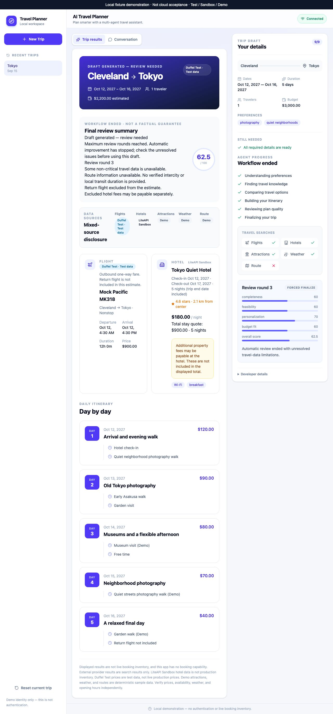
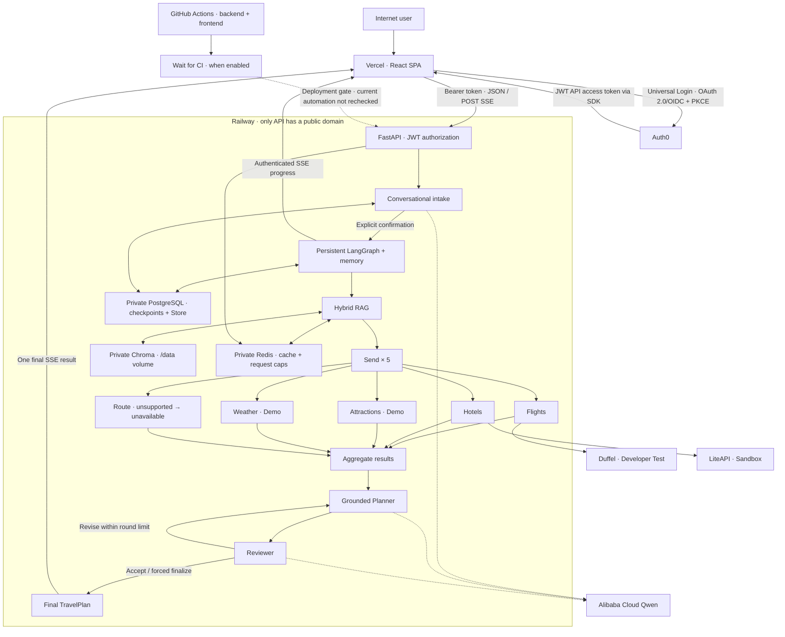

# AI Travel Planning Agent

> A full-stack, stateful multi-agent travel planning system that turns a natural-language conversation into a grounded, reviewed itinerary using LangGraph orchestration, Qwen reasoning, hybrid RAG, parallel travel-search agents, MCP tools, persistent memory, SSE progress streaming, and a React web interface.

---

## Live Demo

- **Frontend:** [AI Travel Planning Agent](https://ai-travel-planning-agent-eight.vercel.app)
- **Backend health:** [Railway API health](https://api-production-0475.up.railway.app/health)

Sign in through Auth0 to use this publicly deployed development/portfolio application.
Intake and planning are rate limited to protect paid AI/provider quotas. Flights use Duffel
Developer Test Mode, hotels use LiteAPI Sandbox, and attractions and weather use Demo data.
The fifth route branch still runs, but unsupported routes are explicitly unavailable, not
invented travel estimates. These are not production booking inventories. There is no booking or
payment capability.
Production API docs and public metrics are intentionally disabled.

**P00–P19 implementation is complete.** The application is publicly deployed, and P19 publication
has been **reported complete by the project owner**. Verification scope and remaining checks
are documented in the [P19 acceptance report](docs/P19_ACCEPTANCE_REPORT.md).
The project now moves to maintenance and optional improvements, not another numbered phase.
P19 rejects unsupported route estimates in the backend and distinguishes reviewer acceptance,
forced-finalized drafts and unknown historical quality; publication is not a claim that every
specific cloud acceptance check has passed.

<details>
<summary>Product screenshot — Local fixture demonstration (not cloud acceptance)</summary>



This is the running local React application with intercepted fixture responses. Test/Sandbox
badges demonstrate disclosure, not a new Duffel/LiteAPI request. The low review score and stopped
improvement state are intentional. [All three screenshots and recording script](docs/DEMO_WALKTHROUGH.md).

</details>

[P19 acceptance report](docs/P19_ACCEPTANCE_REPORT.md) ·
[Quality, compatibility and operator handoff](docs/26_PRODUCT_QUALITY_AND_HANDOFF.md) ·
[Local setup](#local-development-quick-start)

---

## Overview

**AI Travel Planning Agent** is an end-to-end AI application designed and built as a complete travel-planning workflow rather than a single chat completion.

A user can describe a trip in ordinary language, refine incomplete requirements over multiple turns, explicitly confirm the final trip profile, and then watch the planning workflow execute in real time. The backend retrieves relevant travel knowledge, runs five travel-search branches in parallel, uses grounded Qwen reasoning to select and organize candidates, reviews the resulting plan, revises it when necessary, persists thread state and user-approved preferences, and streams progress to a responsive React frontend.

The current system is intentionally engineered around a strict boundary:

**LLMs reason; application code owns facts, validation, state, execution, and safety.**

Qwen is therefore allowed to reason over supplied candidates and produce structured decisions, but it cannot invent authoritative flight prices, hotel prices, weather observations, routes, or booking inventory. Final travel facts are assembled from validated application-owned domain objects.

---

## Current Status

**P00–P19 implementation is complete; P19 publication is complete.**
Local Git records the P19 implementation in `73e9933` —
`fix: clarify itinerary quality and finalize acceptance checks`.
Vercel and Railway publication are recorded from that overall owner confirmation, not a new
inspection of either platform's deployment ID, timestamp or running commit.
**HISTORICAL**, **2026-09-09**: Auth0 login, JWT-authorized API access,
Qwen conversational intake, persistent planning, authenticated POST SSE and restoration of the
previous plan after restarting the Railway API; GitHub-hosted backend/frontend CI passed.
These historical results are not a fresh P19 cloud verification. Historical Qwen/Duffel/LiteAPI
credential revocation was **CONFIRMED on 2026-09-15**; no credential values are recorded.

### Verification Scope

| Evidence | Status and scope |
| --- | --- |
| P19 implementation and Git milestone | LOCAL VERIFIED; `73e9933` contains the feature, tests and handoff |
| P19 Vercel frontend / Railway backend publication | USER-REPORTED COMPLETE; individual deployment revisions not independently checked |
| P19 local validation | LOCAL VERIFIED; backend 795 passed / 21 skipped; Docker integration 15 passed / 1 skipped; frontend run scopes below |
| P18 public acceptance and hosted CI | USER-REPORTED HISTORICAL; 2026-09-09, not a new P19 CI or cloud run |
| Real two-user production isolation | NOT VERIFIED; local JWT/browser-fixture tests passed, but no itemized production evidence is recorded |
| Production Chroma-only restart persistence | NOT VERIFIED; local tool/query comparison passed, not a production restart |

There is no newly recorded P19 **CLOUD VERIFIED** result. Local Git or `origin/main` does not
prove that both cloud services run the same commit. See the report for evidence boundaries;
remaining checks and an optional video do not reopen completed implementation work.

P18 adds authentication and authorization, pseudonymous multi-user resource isolation,
Redis-backed request caps, exact production CORS/trusted hosts, containerized backend deployment,
private Railway PostgreSQL/Redis/Chroma with a Chroma volume, and a Vercel React frontend.
This is a publicly deployed development/portfolio application, not a claim of commercial
production readiness. See [P18 public acceptance](#p18-real-public-acceptance--2026-09-09) for
evidence and the remaining verification boundaries.

| Area | Current state |
| --- | --- |
| Backend | FastAPI + LangGraph |
| Conversational intake | Multi-turn natural-language requirement collection |
| LLM reasoning | Real Alibaba Cloud Qwen mode + deterministic offline mode |
| RAG | Sentence Transformer + BM25 + RRF + deterministic reranking |
| Parallel search | Five LangGraph `Send` branches |
| Tool protocol | FastMCP over STDIO + Streamable HTTP |
| Persistence | PostgreSQL checkpoints + PostgreSQL Store |
| Cache | Redis |
| Vector store | ChromaDB |
| Review loop | Planner → Reviewer → revise/finalize |
| Streaming | POST SSE workflow progress |
| Observability | Loguru + Prometheus + Grafana |
| Frontend | React + TypeScript + Vite + Tailwind CSS |
| Browser runtime validation | Zod |
| Frontend tests | Vitest + React Testing Library + Playwright |
| External travel search | Duffel Flights + LiteAPI Hotels; optional Duffel Stays; search-only |
| Default travel data | Deterministic demo data |
| Authentication / authorization | Auth0 local and Vercel login verified; RS256 API tokens; user-scoped resources |
| Cost protection | Redis intake/planning limits and global request caps |
| Deployment | Vercel SPA + Railway HTTPS API with private PostgreSQL, Redis and Chroma |
| CI/CD | Backend/frontend workflow implemented; hosted success recorded for P18; P19 run and current Railway automation not independently checked |
| Cloud persistence | PostgreSQL-backed plan restored after API restart; separate Chroma restart NOT VERIFIED |
| Booking / payment | **Not implemented** |

The application remains demo-first. `TRAVEL_DATA_MODE=external` uses per-kind selectors, defaulting
to Duffel Flights + LiteAPI Hotels. Attractions and weather stay demo. In P19 the fifth route
branch remains scheduled but returns explicit non-critical unavailability: there is no verified
local/intercity route coverage. Old saved route text is warned about, not rewritten. The integrations
use real HTTP APIs, but test/sandbox data is not production inventory or bookable pricing.
Legacy `TRAVEL_DATA_MODE=duffel` still selects Flights + Stays. There is no booking/payment flow.
Duffel Stays remains optional and NOT VERIFIED because account access was not granted during P17.
See [the P17 acceptance report](docs/P17_ACCEPTANCE_REPORT.md) for the earlier provider acceptance.

The current flight search is **outbound one-way only**. The displayed flight price and plan
estimate exclude a return flight; they are not a complete round-trip airfare quote.

---

## Product Experience

The current user journey is:

```text
Auth0 sign-in (public deployment)
        ↓
Natural-language message
        ↓
Multi-turn conversational intake
        ↓
Partial trip draft + missing-field clarification
        ↓
Explicit user confirmation
        ↓
Persistent LangGraph planning run
        ↓
Long-term preference memory
        ↓
Advanced hybrid RAG
        ↓
Five parallel travel-search branches
        ↓
Grounded Qwen Planner
        ↓
Qwen Reviewer
        ↓
Revision loop when required
        ↓
Final validated TravelPlan (accepted or forced-finalized)
        ↓
SSE progress + React UI
```

A typical conversation can look like:

```text
User:
I want to visit Tokyo in October.
I love photography and prefer quieter neighborhoods.

Assistant:
Where will you be departing from, and what dates are you considering?

User:
Cleveland. October 12 for five days.

Assistant:
How many travelers are going, and what total budget should I use?

User:
One traveler, $3,000 USD.

Assistant:
I have everything I need. Please review and confirm your trip.
```

Only after explicit confirmation does the planning graph run.

---

# Architecture



The deployed search transport is `direct`. Optional MCP transports and local Prometheus/Grafana
remain supported development modes; they are not additional public Railway services. The graph's
progress and final result travel through the same FastAPI POST SSE connection, not a second run.

---

# Core Design Principles

## 1. Grounded LLM reasoning

Qwen does not act as an unrestricted source of travel facts.

The grounded Planner receives validated candidates and selects them using stable candidate IDs. Application code validates those IDs and assembles the final `TravelPlan` from existing domain objects.

This prevents a model response from silently inventing:

- flight numbers,
- hotel names,
- candidate prices,
- attraction IDs,
- routes,
- weather values,
- or unsupported booking information.

## 2. Explicit confirmation before planning

A complete conversational draft does **not** automatically trigger the planning graph.

The user must explicitly confirm the latest SHA-256 draft fingerprint. If the draft changes after the fingerprint was issued, stale confirmation returns HTTP `409` and the graph is not executed.

## 3. One graph run per streaming request

The SSE endpoint executes the LangGraph exactly once.

It does not perform an `astream()` followed by a second `ainvoke()` to obtain the final result. When a final checkpoint read is required, it reads the already persisted state rather than rerunning the graph.

## 4. Parallel search remains real parallel work

The five travel-search categories are dispatched using LangGraph `Send`:

```text
flights
hotels
attractions
weather
route
```

Reducers merge branch results safely without depending on completion order.

## 5. Persistence is separated by responsibility

- **PostgreSQL Checkpointer** stores planning graph checkpoints and history.
- **PostgreSQL Store** stores explicit long-term user preferences and conversational-intake state.
- Conversation intake does not pollute planning checkpoints.
- User preferences are persisted only with explicit user consent.

## 6. Observability avoids high-cardinality labels

Request IDs and thread IDs belong in logs, not Prometheus labels.

Prometheus labels are restricted to bounded sets such as:

- graph status,
- node,
- search kind,
- backend mode,
- MCP tool,
- review decision,
- SSE event type,
- LLM role/status,
- intake status.

---

# Key Features

## Multi-provider external travel search

P17 adds an opt-in, search-only external provider layer:

- Duffel Flight Offer Requests with direct and connecting segments;
- LiteAPI hotel rates with exact Decimal stay totals, nightly averages and excluded-fee warnings;
- optional Duffel Stays adapter (real acceptance NOT VERIFIED; account access was not granted during P17);
- official Duffel Places suggestions for city/IATA/coordinate resolution;
- fixed-host authentication and one lifespan-owned async pool per external provider;
- bounded timeout/retry behavior and safe provider errors;
- truthful demo, Duffel test/live, LiteAPI sandbox/production, and explicit fallback provenance;
- direct and MCP transport parity;
- no silent fallback and no booking endpoints.

The safe default remains:

```dotenv
TRAVEL_DATA_MODE=demo
```

To opt into external test/sandbox mode, configure keys privately in the ignored `.env` file:

```dotenv
TRAVEL_DATA_MODE=external
TRAVEL_FLIGHT_PROVIDER=duffel
TRAVEL_HOTEL_PROVIDER=liteapi
DUFFEL_ENV=test
LITEAPI_ENV=sandbox
DUFFEL_ALLOW_DEMO_FALLBACK=false
LITEAPI_ALLOW_DEMO_FALLBACK=false
```

Never put a real token in `.env.example`, source code, frontend code, commands committed to Git,
or documentation. Configure `DUFFEL_ACCESS_TOKEN` and `LITEAPI_API_KEY` privately. LiteAPI needs
explicit trip `guest_nationality`; intake asks for it before confirmation. It is not automatically
saved as a long-term preference. Demo and legacy Duffel planning do not require it.
The shared location resolver currently uses Duffel Places, including for LiteAPI hotels.
Project dates are inclusive: Oct 12–16 means five itinerary days and five hotel nights, with
checkout Oct 17. Hotel search supports one room for one or two adults. The exact Decimal stay
total is retained; the rounded nightly average is never multiplied back to recreate the total.
Hotel totals exclude any separately payable property fees; never assume all-in.

## Conversational trip intake

The P15 intake layer supports:

- natural-language requirements,
- partial trip drafts,
- deterministic missing-field detection,
- multi-turn updates,
- corrections,
- field clearing,
- budget updates,
- preference addition/removal,
- duration-based date derivation,
- restart-safe persistence,
- stale-confirmation protection,
- explicit confirmation,
- safe reset / new-trip semantics.

Example:

```text
"I want Tokyo."
→ destination = Tokyo

"Actually make that Paris."
→ destination = Paris
```

The second message updates the existing draft rather than generating a completely new ungrounded state.

---

## Advanced hybrid RAG

The current RAG stack contains:

```text
Deterministic multi-query expansion
        ↓
Dense retrieval
+
BM25 sparse retrieval
        ↓
Reciprocal Rank Fusion
        ↓
Deterministic reranker
        ↓
Child-to-parent context mapping
        ↓
Redis cache-aside
```

### Current RAG implementation

- Embedding model: `sentence-transformers/paraphrase-multilingual-MiniLM-L12-v2`
- Embedding dimension: `384`
- Markdown corpus: `12` documents
- Parent documents: `36`
- Child chunks: `77`
- Chroma collection: `travel_knowledge_children_v1`
- Legacy P06 collection retained: `travel_knowledge`
- Cache TTL: `3600` seconds
- RRF constant: `60`

### Current offline evaluation

The repository contains a fixed 24-query bilingual evaluation fixture.

| Retrieval mode | Precision@4 | Recall@4 | MRR@4 | NDCG@4 |
| --- | ---: | ---: | ---: | ---: |
| Dense only | 0.406250 | 0.704861 | 0.732639 | 0.617939 |
| BM25 only | 0.250000 | 0.416667 | 0.534722 | 0.404095 |
| Hybrid RRF | 0.250000 | 0.423611 | 0.531250 | 0.409361 |
| Hybrid reranked | 0.375000 | 0.642361 | **0.788194** | **0.691358** |

These results are intentionally reported as mixed rather than presented as a blanket improvement. The hybrid reranked configuration improves MRR/NDCG relative to the dense-only baseline in this small fixture, while dense-only remains stronger on Precision/Recall.

This is a local demo benchmark, not evidence of production retrieval quality.

See [`docs/17_ADVANCED_RAG.md`](docs/17_ADVANCED_RAG.md) and [`docs/evaluation/P10_RAG_EVALUATION.md`](docs/evaluation/P10_RAG_EVALUATION.md).

---

## Five-way parallel travel search

Each request fans out to:

- Flights
- Hotels
- Attractions
- Weather
- Route

The search layer implements a common `SearchBackend` abstraction.

Two backend modes are available:

```text
direct
mcp
```

`direct` calls the configured demo or external providers in the backend process.

`mcp` uses MCP tools while preserving the exact same graph search contract.

Critical search failures:

- flights,
- hotels.

Non-critical failures:

- attractions,
- weather,
- route.

The planner never silently invents missing critical results. The fifth route search still executes;
without verified coverage it returns an explicit non-critical error. P19 blocks the old synthetic
route minutes in the provider, worker, Planner inputs and final assembly—not just in the UI.
This is not a real map or transit integration.

---

## MCP tool layer

P11 introduced MCP tools; P17 extended flights/hotels to the configured external providers while
preserving the tool contract. Weather and attractions remain deterministic Demo data. The route
tool remains discoverable/called, but unsupported routes report non-critical unavailability.

### STDIO server

```text
get_weather
get_route
```

### Streamable HTTP server

```text
search_flights
search_hotels
search_attractions
```

`MultiServerMCPClient` discovers all five tools and maps them back into the existing `SearchBackend`.

Qwen does **not** independently decide which MCP tool to call. Tool mapping remains application-controlled so that parallelism, failure semantics, and tests remain deterministic.

See [`docs/18_MCP_TOOL_LAYER.md`](docs/18_MCP_TOOL_LAYER.md).

---

## Planner–Reviewer reflection loop

After search aggregation:

```text
Planner
   ↓
Reviewer
   ├── revise → Planner
   └── accept / forced finalize → Finalize
```

The Reviewer evaluates:

- completeness,
- feasibility,
- personalization,
- budget fit.

Qwen can provide structured review scores and critique in Qwen mode, but application code still controls:

- score validation,
- overall scoring policy,
- threshold comparison,
- maximum review rounds,
- forced finalization,
- allowed revision actions.

This prevents the model from creating an unbounded self-reflection loop.

The historical, owner-reported P18 Cleveland → Tokyo acceptance run reached
**review round 3 and forced finalization**.
The Reviewer identified a feasibility/factual problem in the supplied Demo route estimate.
Finalization therefore does **not** mean every plan met the quality threshold. A Reviewer can
flag bad candidate facts, but cannot replace them with authoritative real-world routing.

P19 makes that distinction explicit in the durable plan and the UI:

| Outcome | Meaning |
| --- | --- |
| Workflow ended | Computation ended; no continuing Improving, revision spinner or loading state |
| Reviewer accepted | The review threshold was met; test/sandbox facts still require independent verification |
| Forced finalization | The round limit was reached; preserve the actual score/issues and show a draft needing review |
| Historical quality unavailable | Missing trustworthy checkpoint fields; show unknown, never invent a score or default to accepted |

Refresh and history reads retain the quality/warnings without executing graph, Qwen or provider
search again. The P18 route defect is now handled in the backend as unavailable; existing saved
route text is warned about rather than silently rewritten.

See [`docs/16_PLANNER_REVIEWER_REFLECTION.md`](docs/16_PLANNER_REVIEWER_REFLECTION.md).

---

## Real Qwen reasoning

The project supports:

```text
AGENT_REASONING_MODE=deterministic
AGENT_REASONING_MODE=qwen
```

The default is deterministic so local development, CI, and the normal test suite require no API key and make no paid LLM request.

In Qwen mode:

- the Planner uses Qwen for grounded candidate selection,
- the Reviewer uses Qwen for structured evaluation and critique,
- conversational intake uses Qwen for structured requirement extraction.

All model outputs that affect application state pass through:

```text
JSON structured output
→ strict JSON parsing
→ Pydantic validation
→ application-level grounding checks
```

The implementation rejects:

- duplicate JSON keys,
- non-standard `NaN` / `Infinity`,
- invalid schema values,
- hallucinated candidate IDs,
- unsupported revisions,
- malformed structured responses.

Prompt inputs are treated as untrusted data and delimiter injection is escaped.

See [`docs/21_QWEN_LLM_INTEGRATION.md`](docs/21_QWEN_LLM_INTEGRATION.md).

---

## Persistent memory

The system uses two separate persistence concepts.

### Thread checkpoints

PostgreSQL `AsyncPostgresSaver` stores:

- LangGraph thread state,
- graph checkpoints,
- checkpoint history.

### Long-term preferences

PostgreSQL `AsyncPostgresStore` stores explicitly approved user preferences across threads.

For example:

```text
"avoid crowded tourist areas"
```

can persist across different trip threads if the user explicitly chooses to remember it.

Ordinary trip preferences are not silently promoted into long-term memory.

See [`docs/14_PERSISTENCE_AND_MEMORY.md`](docs/14_PERSISTENCE_AND_MEMORY.md).

---

## SSE workflow streaming

Persistent planning can be streamed through POST SSE.

Events include:

```text
run_started
node_started
node_completed
search_started
search_completed
search_failed
retrieval_completed
review_completed
revision_started
plan_completed
error
```

The browser uses `fetch()` + `ReadableStream`, not native `EventSource`, because confirmation requires a POST body.

The frontend parser handles:

- arbitrary byte chunk boundaries,
- split UTF-8 sequences,
- LF / CRLF,
- multiple `data:` lines,
- comment heartbeats,
- unknown SSE fields,
- stream cancellation.

Heartbeat comments such as:

```text
: ping
```

are transport keepalives and do not consume business event IDs.

See [`docs/19_SSE_STREAMING.md`](docs/19_SSE_STREAMING.md).

---

# Web Application

P16 adds a responsive React SPA in [`frontend/`](frontend).

The frontend provides:

- natural-language chat,
- multi-turn intake,
- assistant clarification messages,
- live trip draft,
- missing / invalid field display,
- explicit confirmation,
- preference-memory opt-in,
- five-way search progress,
- Reviewer scores,
- revision status,
- final structured itinerary,
- budget warnings,
- Stop / Retry controls,
- reload recovery,
- New Trip,
- Reset,
- responsive desktop/tablet/mobile layouts,
- accessibility baseline.

The browser never receives the Qwen API key and never connects directly to PostgreSQL, Redis, Chroma, or MCP.

```text
Browser
  ↓
FastAPI
  ↓
Qwen / LangGraph / PostgreSQL / Redis / Chroma / MCP
```

## Authentication and authorization

The public SPA uses **Auth0 Universal Login**, OAuth 2.0/OIDC and Authorization Code + PKCE.
The SDK obtains an **API access token**, not an ID token for authorizing API requests, and keeps
it in memory. The central HTTP client attaches it to both JSON and POST SSE requests.

FastAPI validates the RS256 signature, exact issuer, API audience and expiry. Signing keys come
from the configured issuer's JWKS endpoint and use a bounded, cached async client; token-supplied
key URLs are not trusted. Real local login and Vercel production login were verified on 2026-09-09.

Authentication identifies the caller; authorization limits access to that caller's resources.
Validated identity becomes a deterministic pseudonymous internal `user_ref`. This is
pseudonymization, not encryption. Thread/checkpoint namespaces, intake and preferences are
scoped to that reference. Browser-supplied `user_id` values cannot select another account's data.
P19 local JWT/PostgreSQL and browser-fixture isolation tests cover non-empty A/B data using the
same public thread UUID. Account switching clears prior conversation, plan and recent-trip UI;
late A responses cannot repopulate B's page. These are local signed-token/mock-SDK tests, not
real Auth0 two-user cloud acceptance; the latter remains **NOT VERIFIED** without itemized evidence.

### Local/demo identity versus public identity

In `VITE_AUTH_MODE=demo`, a UUID in `localStorage` supports local development only; it is
**not authentication or authorization**. In production/Auth0 mode, identity comes only from
the validated access token, and local thread pointers are account-scoped. No Auth0 client
secret or backend provider key belongs in the SPA. See
[authentication and deployment](docs/25_AUTH_AND_DEPLOYMENT.md) for configuration details.

The browser stores only lightweight local metadata such as:

- demo user ID,
- active thread ID,
- recent thread metadata.

The backend remains the source of truth for conversation state and final travel-plan state.

See [`docs/23_WEB_CHAT_FRONTEND.md`](docs/23_WEB_CHAT_FRONTEND.md).

---

# Observability

P13+ adds application observability with:

- structured one-line JSON logs,
- `X-Request-ID`,
- ContextVar request context,
- Prometheus metrics,
- Grafana provisioning,
- an automatically provisioned dashboard.

The current dashboard contains **32 panels** covering areas such as:

- HTTP traffic and latency,
- graph runs,
- node duration,
- RAG cache behavior,
- travel search tasks,
- MCP tools,
- review outcomes,
- SSE connections,
- Qwen requests,
- intake activity,
- external provider request outcomes and p95 duration,
- per-search data-source provenance,
- dependency readiness.

Prometheus and Grafana are observers only; their failure does not make the travel-planning API unavailable.
These are local/optional monitoring facilities. Public metrics are disabled in the deployed
Railway API; there is no public Grafana deployment claimed here.

See [`docs/20_OBSERVABILITY.md`](docs/20_OBSERVABILITY.md).

---

# Technology Stack

## Backend

| Technology | Purpose |
| --- | --- |
| Python 3.12 | Backend runtime |
| FastAPI | HTTP API |
| LangGraph | Stateful workflow orchestration |
| Pydantic v2 | Strict domain and API validation |
| PostgreSQL | Checkpoints, history, memory/intake Store |
| Redis | RAG cache / parent documents / authenticated request caps |
| ChromaDB | Vector retrieval |
| Sentence Transformers | Local semantic embeddings |
| rank-bm25 | Sparse retrieval |
| FastMCP | MCP servers |
| langchain-mcp-adapters | MCP → LangChain tool integration |
| OpenAI Python SDK | OpenAI-compatible client for Alibaba Qwen |
| Loguru | Structured application logging |
| prometheus-client | Application metrics |
| Docker Compose | Local infrastructure |

## Frontend

| Technology | Purpose |
| --- | --- |
| React 19 | UI |
| TypeScript | Static frontend typing |
| Vite 8 | Dev server / build |
| Tailwind CSS 4 | Styling |
| Zod | Runtime network validation |
| Vitest | Frontend unit tests |
| React Testing Library | Component tests |
| Playwright | Browser E2E |

## Monitoring

| Technology | Purpose |
| --- | --- |
| Prometheus | Metrics collection |
| Grafana | Dashboard visualization |

## Identity, providers and deployment

| Technology | Purpose |
| --- | --- |
| Auth0 | Universal Login, OIDC/PKCE and RS256 API access tokens |
| Alibaba Cloud Qwen | Structured intake, grounded Planner and Reviewer |
| Duffel | Flight search in Developer Test Mode; optional unverified Stays adapter |
| LiteAPI | Hotel search in Sandbox |
| Railway | Containerized FastAPI and private PostgreSQL/Redis/Chroma |
| Vercel | Public React SPA deployment |
| GitHub Actions | Hosted backend/frontend CI; Railway deployment gate |

---

# Public Deployment — P18 Foundation and P19 Release

The frontend is hosted on Vercel and calls the HTTPS Railway API directly, including authenticated
POST SSE. Public deployment is separate from the [local quick start](#local-development-quick-start).

## Railway services

| Service | Exposure and responsibility |
| --- | --- |
| `api` | Only public Railway service; FastAPI, auth, graph, bootstrap and local embedding runtime |
| `postgres` | Private; checkpoints, history, conversational state and explicit preference Store |
| `redis` | Private; cache, parent-document support and atomic request caps |
| `chroma` | Private; vector retrieval; persistent volume mounted at `/data` |

PostgreSQL, Redis and Chroma runtime were recorded in the historical P18 deployed workflow.
The Chroma `/data`
volume is **CONFIGURED**; preservation across a separate **Chroma service restart is NOT VERIFIED**.
API restart recovery verifies PostgreSQL-backed application state, not that separate Chroma test.

## CI/CD

Actual GitHub-hosted CI was verified on 2026-09-09. The
[workflow](.github/workflows/ci.yml) has two jobs:

- `backend`: locked dependencies, Ruff lint/format checks, mypy and pytest.
- `frontend`: lint, typecheck, Vitest, production build and mock Playwright browser tests.

Normal CI uses deterministic/demo modes and makes no real Qwen, Duffel, LiteAPI or Auth0 calls.
Railway **Wait for CI** is the documented gate when GitHub-connected automatic deployment is
enabled. Its current switch state, whether automatic deployment was re-enabled, and a new P19
hosted CI result have not been independently checked. Do not infer them from local Git.
The public frontend is deployed on Vercel; a successful build alone is not browser/cloud acceptance.

## P19 publication record

P19 implementation commit: `73e9933` — `fix: clarify itinerary quality and finalize acceptance checks`.
The owner reports the publication operations complete (**USER-REPORTED COMPLETE**), covering the
Vercel frontend and Railway backend at the overall release level. No per-platform deployment ID,
exact publication time or running SHA is supplied by that general confirmation.

The release handoff order was **new frontend → old-tab refresh/close → new backend**, because
the new frontend accepts old payloads while the old strict Zod frontend rejects the new fields.
The completion report closes that release handoff; it is not a per-tab refresh audit or proof of
the deployed revisions. Future releases must preserve this compatibility rule and allow a short
controlled window if needed. Already-open browsers cannot all be forcibly upgraded automatically.
See the [P19 report](docs/P19_ACCEPTANCE_REPORT.md) for separately unverified cloud checks.

## Bootstrap hardening and memory

The P18 deployment follow-up bounds fresh RAG indexing: `RAG_BOOTSTRAP_BATCH_SIZE=8` by default,
so the existing **77 child chunks use 10 batches**. Both deployment indexing and the embedding
encode path are bounded. Previously all missing children were passed to one adapter operation
(the model still had its own internal batching).

The model, corpus, IDs, 384-dimensional vectors and retrieval semantics were not intentionally
changed. Bootstrap-only model references are released before the normal runtime model is
initialized, and safe stage diagnostics identify progress without printing secrets or corpus text.

The SentenceTransformer/PyTorch runtime still needs substantial memory. The original 1 GiB
Railway Trial allocation was insufficient for this setup; the deployed API now uses a sufficient
memory allocation for the existing embedding runtime. A controlled **local arm64 Docker** test
recorded the following—not Railway production measurements:

| Local API memory limit | Observed result |
| --- | --- |
| 1 GiB | OOMKilled, exit 137, during model loading before indexing |
| 2 GiB | Fresh indexing, readiness, planning and restart passed |

The successful local container's cgroup peak was **1,543,884,800 bytes (approximately 1.44 GiB)**,
including cgroup charges/page cache, not only Python RSS. This is not a cloud sizing guarantee;
the fix did **not** reduce the runtime below 1 GiB. No Railway production peak or pricing is claimed.
See the [historical bootstrap fix report](docs/P18_BOOTSTRAP_FIX_REPORT.md) for the experiment.

## P18 real public acceptance — 2026-09-09

The following records the project owner's completed real acceptance, not a fresh paid run made
as part of this README update:

```text
Vercel → Auth0 → JWT → Railway FastAPI → PostgreSQL / Redis / Chroma
       → Qwen → Duffel Flights + LiteAPI Hotels → LangGraph Planner/Reviewer
       → authenticated POST SSE → one final TravelPlan → Vercel UI
```

| Acceptance check | Actual outcome |
| --- | --- |
| GitHub-hosted backend and frontend CI | VERIFIED |
| Auth0 local and production login; API access token; FastAPI JWT validation | VERIFIED |
| Authenticated Vercel → Railway HTTPS requests | VERIFIED |
| Exact production CORS | VERIFIED through successful Vercel → Railway execution |
| Trusted hosts | VERIFIED through public API access and Railway healthcheck |
| Public `/health` and `/ready` | HTTP 200 VERIFIED |
| `/ready` service summaries | `postgresql=ok`, `redis=ok`, `chroma=ok`, `qwen=ok`, `duffel=ok`, `liteapi=ok` |
| Real public conversational intake and Qwen extraction | VERIFIED |
| Persistent planning and authenticated POST SSE | VERIFIED; exactly one final TravelPlan reached the frontend |
| PostgreSQL-backed application state across API restart | VERIFIED; prior plan restored without rerunning the graph |

The public frontend, `/health` and `/ready` also returned HTTP 200 during the README-only check.
The readiness endpoint actively probes PostgreSQL, Redis and Chroma; its Qwen/Duffel/LiteAPI
statuses check configuration/runtime initialization, **not paid external requests**. The real
external-call evidence comes from the completed planning acceptance above.

In that **Cleveland → Tokyo** run, the frontend displayed Flights as **“Duffel Test · Test data”**,
Hotels as **“LiteAPI Sandbox”**, and Attractions, Weather and Route as **“Demo”**. These are
test/sandbox search results, not production airfare or hotel availability.

The Demo route produced a logically invalid cross-city/cross-continent estimate. Qwen Reviewer
identified the feasibility/factual issue, but the run reached **round 3 and forced finalization**;
delivery of a final plan is not proof that it passed the review threshold. Application code
controls the round maximum, scoring policy and forced finalization. Demo routes are not
authoritative, and the flight estimate remains outbound one-way only, without return airfare.

After the run, **only the Railway API service was restarted**. `/ready` returned HTTP 200 again;
the same authenticated user refreshed Vercel and recovered the previous Tokyo TravelPlan without
rerunning the graph. Chroma itself was not restarted. A separate real two-user production
isolation test also remains **NOT VERIFIED**.

The [deployment guide](docs/25_AUTH_AND_DEPLOYMENT.md),
[P18 local acceptance report](docs/P18_ACCEPTANCE_REPORT.md) and
[bootstrap fix report](docs/P18_BOOTSTRAP_FIX_REPORT.md) preserve earlier implementation-stage
evidence. Their cloud-pending/old memory-allocation statements describe that historical stage;
this dated README section records the subsequent P18 public acceptance. The P19 publication
record above is separate and does not retroactively change those historical reports.

---

# Repository Structure

```text
.
├── app/
│   ├── api/                 # FastAPI routes
│   ├── auth/                # JWT identity, resource scoping, request caps
│   ├── core/                # settings, lifecycle, resources
│   ├── deployment/          # bounded startup bootstrap + container entry point
│   ├── domain/              # travel-domain models
│   ├── graphs/              # LangGraph workflow + nodes
│   ├── intake/              # conversational intake
│   ├── infrastructure/      # PostgreSQL / Redis / Chroma
│   ├── llm/                 # Qwen provider, grounding, schemas
│   ├── mcp_tools/           # MCP servers/client/backend
│   ├── memory/              # preference memory
│   ├── observability/       # logs, metrics, instrumentation
│   ├── rag/                 # advanced hybrid retrieval
│   ├── review/              # review/revision policy
│   ├── search/              # parallel search abstraction
│   ├── services/            # planning assembly
│   └── streaming/           # SSE layer
│
├── frontend/                # React web application
├── data/
│   ├── knowledge/           # local demo knowledge corpus
│   └── evaluation/          # RAG evaluation fixtures
├── docs/                    # implementation guides
├── observability/           # Prometheus/Grafana configuration
├── reports/                 # generated evaluation reports
├── scripts/                 # setup/check/index/evaluation helpers
├── tests/                   # backend tests
├── .github/workflows/       # hosted CI
├── Dockerfile               # Railway API image
├── railway.toml             # API deployment / readiness configuration
├── docker-compose.yml
├── pyproject.toml
└── README.md
```

---

# Local Development Quick Start

Local development does not require Railway, Vercel or an Auth0 account. Repository defaults
retain `AUTH_MODE=demo`, `VITE_AUTH_MODE=demo`, deterministic reasoning and demo travel data.
The optional Qwen step below enables the full natural-language conversation and makes paid
requests; omit it for offline checks and deterministic planning. Local UUID identity must not
be used to expose an unauthenticated public service.

## Prerequisites

Recommended local environment:

- macOS / Linux
- Docker Desktop / Docker Engine
- Python 3.12
- [`uv`](https://docs.astral.sh/uv/)
- Node.js 24 LTS
- npm

Clone the repository and enter it:

```bash
git clone https://github.com/zoomwill/ai-travel-planning-agent.git
cd ai-travel-planning-agent
```

Install backend dependencies:

```bash
uv sync
```

Install frontend dependencies:

```bash
cd frontend
npm ci
cd ..
```

Create local environment files only if missing; these commands do not overwrite existing files:

```bash
test -e .env || cp .env.example .env
test -e frontend/.env || cp frontend/.env.example frontend/.env
```

Keep backend secrets only in the ignored root `.env`; frontend configuration contains public
values only. If you previously enabled Auth0/external providers, review those local settings
before following the demo flow. Start Docker Desktop before the next command.

---

## 1. Start infrastructure

```bash
docker compose up -d --wait --wait-timeout 120
```

Check it:

```bash
uv run python scripts/check_infra.py
```

Initialize LangGraph persistence:

```bash
uv run python scripts/setup_langgraph_persistence.py
```

---

## 2. Prepare the advanced RAG model and index

The project deliberately does not download or index the embedding model during ordinary imports or tests.

Prepare the local embedding model:

```bash
uv run python scripts/prepare_rag_model.py
```

Index the local corpus:

```bash
uv run python scripts/index_advanced_knowledge.py
```

Optional offline evaluation:

```bash
uv run python scripts/evaluate_advanced_rag.py
```

---

## 3. Optional: configure Qwen for the full conversational experience

The complete P15/P16 conversational experience requires Qwen mode.

Copy the relevant values into the root `.env` file.

Example:

```dotenv
AGENT_REASONING_MODE=qwen
QWEN_MODEL=qwen3.7-plus
QWEN_BASE_URL=https://<your-model-studio-workspace>/compatible-mode/v1
QWEN_API_KEY=<your-key>
QWEN_MAX_COMPLETION_TOKENS=2048
QWEN_ALLOW_DETERMINISTIC_FALLBACK=false
```

The real `.env` file is ignored by Git.

Never place a real key in:

- source code,
- frontend `.env`,
- README examples,
- test fixtures,
- shell scripts,
- screenshots.

A smoke test is available:

```bash
uv run python scripts/check_qwen.py
```

The model is configurable; `qwen3.7-plus` is one model that has been used for real local acceptance testing.

---

## 4. Start FastAPI

```bash
uv run uvicorn app.main:app \
  --host 127.0.0.1 \
  --port 8000 \
  --no-access-log
```

Local endpoints (docs/metrics require their development toggles; they are disabled in production):

```text
http://127.0.0.1:8000/docs
http://127.0.0.1:8000/health
http://127.0.0.1:8000/ready
http://127.0.0.1:8000/metrics
```

---

## 5. Start the React frontend

In another terminal:

```bash
cd frontend
npm run dev
```

Open:

```text
http://127.0.0.1:5173
```

Vite proxies API requests to the local FastAPI backend, so broad CORS permissions are not required for normal development.

---

# Optional MCP Mode

The default search backend is `direct`.

To run the MCP boundary, start the Streamable HTTP MCP server:

```bash
uv run python -m app.mcp_tools.servers.travel_http
```

Check discovery:

```bash
uv run python scripts/check_mcp_tools.py
```

Then start FastAPI in MCP mode:

```bash
TRAVEL_SEARCH_BACKEND_MODE=mcp \
uv run uvicorn app.main:app \
  --host 127.0.0.1 \
  --port 8000 \
  --no-access-log
```

The STDIO MCP server is created and managed by the client.

---

# Optional Prometheus + Grafana

Start the observability profile:

```bash
docker compose --profile observability up -d --wait --wait-timeout 180
```

Run the checker:

```bash
uv run python scripts/check_observability.py
```

Open:

```text
Prometheus: http://127.0.0.1:9090
Grafana:    http://127.0.0.1:3000
```

Stop the observability containers while preserving their volumes:

```bash
docker compose --profile observability stop prometheus grafana
```

Do **not** run `docker compose down -v` unless you intentionally want to erase local named-volume data.

---

# API Surface

| Method | Endpoint | Purpose |
| --- | --- | --- |
| GET | `/health` | Liveness |
| GET | `/ready` | Dependency readiness |
| GET | `/metrics` | Optional local Prometheus metrics; disabled in production |
| POST | `/api/v1/plans/mock` | Deterministic planning MVP |
| POST | `/api/v1/agents/plans` | Non-persistent agent planning |
| POST | `/api/v1/agents/threads/{thread_id}/plans` | Persistent planning |
| POST | `/api/v1/agents/threads/{thread_id}/plans/stream` | Persistent planning SSE |
| GET | `/api/v1/agents/threads/{thread_id}/state` | Safe thread-state summary |
| GET | `/api/v1/agents/threads/{thread_id}/history` | Thread history |
| POST | `/api/v1/agents/threads/{thread_id}/conversation/messages` | Conversational intake turn |
| GET | `/api/v1/agents/threads/{thread_id}/conversation` | Recover intake state |
| POST | `/api/v1/agents/threads/{thread_id}/conversation/confirm` | Confirm and plan |
| POST | `/api/v1/agents/threads/{thread_id}/conversation/confirm/stream` | Confirm and plan via SSE |
| POST | `/api/v1/agents/threads/{thread_id}/conversation/reset` | Reset current intake |
| GET | `/api/v1/me/preferences` | Authenticated caller's explicit long-term preferences |
| DELETE | `/api/v1/me/preferences/{preference_id}` | Delete the authenticated caller's preference |
| GET | `/api/v1/users/{user_id}/preferences` | List explicit long-term preferences |
| DELETE | `/api/v1/users/{user_id}/preferences/{preference_id}` | Delete one preference |
| GET | `/api/v1/rag/status` | RAG diagnostic summary |
| POST | `/api/v1/rag/search` | Local RAG diagnostic search |
| GET | `/api/v1/mcp/status` | MCP status |
| GET | `/api/v1/llm/status` | LLM configuration status |
| GET | `/api/v1/travel-data/status` | Local travel-data configuration status; no remote probe |

In production/Auth0 mode, all planning, conversation, state/history, preference and diagnostic
routes above require a valid API access token. Ownership comes from the verified principal,
not a supplied `user_id`; prefer `/me/preferences` for authenticated use. `/health` and `/ready`
remain public safe summaries. Production API docs and the metrics endpoint are disabled.

---

# Conversational API Example

These localhost examples are for **demo authentication mode only**. Production requests require
Auth0 API access-token authorization; the deployed frontend handles it without copying tokens
into shell commands. A browser UUID or the example `user_id` is not a production credential.

Send the first message:

```bash
curl --noproxy '*' \
  --silent \
  --show-error \
  --request POST \
  --header 'Content-Type: application/json' \
  --data '{
    "user_id": "local-demo-user",
    "message": "I want to visit Tokyo from Cleveland for five days in October."
  }' \
  'http://127.0.0.1:8000/api/v1/agents/threads/local-demo-thread/conversation/messages'
```

Continue:

```bash
curl --noproxy '*' \
  --silent \
  --show-error \
  --request POST \
  --header 'Content-Type: application/json' \
  --data '{
    "user_id": "local-demo-user",
    "message": "October 12, one traveler, 3000 USD. I like photography and quiet neighborhoods."
  }' \
  'http://127.0.0.1:8000/api/v1/agents/threads/local-demo-thread/conversation/messages'
```

Retrieve the latest draft:

```bash
curl --noproxy '*' \
  --silent \
  --show-error \
  'http://127.0.0.1:8000/api/v1/agents/threads/local-demo-thread/conversation?user_id=local-demo-user'
```

When `can_confirm=true`, send the current `draft_fingerprint` to the confirmation endpoint.

---

# Streaming Example

This is also a localhost/demo-auth example; the public SPA sends an authenticated POST instead.

```bash
curl --noproxy '*' -N \
  --request POST \
  --header 'Content-Type: application/json' \
  --data '{
    "user_id": "local-demo-user",
    "draft_fingerprint": "<current-fingerprint>",
    "remember_preferences": []
  }' \
  'http://127.0.0.1:8000/api/v1/agents/threads/local-demo-thread/conversation/confirm/stream'
```

A normal successful stream ends with exactly one:

```text
event: plan_completed
```

A graph/runtime failure after streaming has begun ends with exactly one:

```text
event: error
```

A client disconnect is treated as cancellation rather than a business error.

---

# Testing

## Backend

Run the normal offline suite:

```bash
uv run ruff check .
uv run ruff format --check .
uv run mypy app
uv run pytest -q
```

Latest P19 pre-publication offline result, recorded on 2026-09-15 in the
[P19 acceptance report](docs/P19_ACCEPTANCE_REPORT.md), not rerun for this Markdown update:

```text
795 passed
21 skipped
```

Run infrastructure integration tests explicitly:

```bash
RUN_INTEGRATION_TESTS=1 \
uv run pytest -m integration -q
```

P19 local Docker integration result from that report (not a cloud/provider test):

```text
15 passed
1 skipped
800 deselected
```

The skipped case needs separately enabled observability services. These tests isolate local
database hosts and deterministic/fake external services from private `.env` settings. P19 also
passed Ruff, format, mypy, the production-image build and the read-only Chroma tool in a 2 GiB
local container: 77 records / 384 dimensions, matching summaries/direct query, no second full
embedding-model load. A local comparison without a Chroma restart is not restart persistence.
Earlier P18 results remain in the [historical bootstrap report](docs/P18_BOOTSTRAP_FIX_REPORT.md).

Real Qwen tests are gated separately to avoid accidental API usage and cost.

Real Duffel tests are also independent from normal infrastructure tests:

```bash
RUN_DUFFEL_INTEGRATION_TESTS=1 \
uv run pytest -m duffel_integration -q

uv run python scripts/check_duffel.py
# Flights only. Do not run Stays for P17 acceptance; account access was not granted.

RUN_LITEAPI_INTEGRATION_TESTS=1 uv run python scripts/check_liteapi.py
```

These commands make real external requests. The ordinary `uv run pytest -q` and
`RUN_INTEGRATION_TESTS=1` suites do not contact Duffel or LiteAPI. The LiteAPI checker requires its
explicit gate and a configured sandbox key; zero rates is a failure, not fabricated success.

Earlier P17 real acceptance on 2026-09-08: LiteAPI gate passed with 4 mapped sandbox hotels;
one Duffel Flights regression returned 70 raw offers; one real persistent mixed Qwen/SSE path
passed with 5 flight and 10 hotel candidates per Planner call. Planner and Reviewer each ran
three times within the configured limit. Existing metrics reported 13,137 input tokens and
1,601 output tokens, not estimates. All fallbacks and retries were disabled for that one path.
No Stays request was made. These are test/sandbox results, not production real-time inventory.
The [complete report](docs/P17_ACCEPTANCE_REPORT.md) includes the paid gates; do not repeat them
as ordinary regression tests.

P18 hosted CI and public authenticated acceptance were subsequently verified on 2026-09-09;
see [the dated public acceptance section](#p18-real-public-acceptance--2026-09-09). That does not
turn these explicitly gated real-provider commands into ordinary regression checks.

---

## Frontend

```bash
cd frontend

npm run lint
npm run typecheck
npm run test:run
npm run build
npm run test:e2e
```

P19 implementation validation, recorded before the later pre-publication integration check:

```text
Vitest:
15 test files passed
85 tests passed

Playwright:
6 fixture browser E2E tests passed
2 gated real-backend tests skipped

Production build:
PASS
```

A real browser/Qwen E2E is intentionally gated and is not part of ordinary frontend testing.
The later P19 integration follow-up ran only the affected quality subset: **5 passed**. It did
not rerun the full frontend suite. This Markdown-only update reruns neither suite; counts describe
separate runs and are not added together. See [P19 acceptance](docs/P19_ACCEPTANCE_REPORT.md).

---

# Validated Frontend Behavior

P16 was manually checked at:

```text
375 px
768 px
1280 px
1440 px
```

The current UI has been verified for:

- no horizontal overflow,
- responsive trip details,
- desktop three-column layout,
- mobile final itinerary,
- backend-offline state,
- mock reload recovery,
- multi-turn chat → confirmation → SSE → final itinerary,
- no raw JSON in the user-facing interface.

---

# Security Boundaries

The current codebase deliberately enforces several safety boundaries.

## Secrets

Real secrets must remain in ignored backend environment files for local development or private
backend service variables on Railway. Never put them in Git, Docker build arguments or a browser
bundle. The SPA uses a public Auth0 client ID; it does not need a client secret.

The frontend never needs:

```text
QWEN_API_KEY
DASHSCOPE_API_KEY
DUFFEL_ACCESS_TOKEN
LITEAPI_API_KEY
PostgreSQL DSN
Redis credentials
```

## Prompt safety

User messages, RAG documents, and provider text are treated as untrusted data.

Prompt delimiters are escaped and credential-shaped text is redacted before forwarding.

## Structured LLM responses

Application-changing LLM outputs are strictly parsed and validated.

The system rejects:

- duplicate JSON keys,
- `NaN`,
- `Infinity`,
- schema violations,
- unsupported IDs,
- invalid revisions.

## Logging

Normal structured logs do not contain:

- complete user messages,
- prompts,
- completions,
- TravelPlan Markdown,
- RAG context,
- API keys,
- Authorization headers,
- full DSNs.

## Prometheus

High-cardinality values such as the following are never used as metric labels:

- request ID,
- user ID,
- thread ID,
- destination,
- query,
- candidate ID,
- error text.

## Browser

In demo mode, the browser uses a local UUID only as a demo identity.

It is not authentication or authorization.

Production Auth0 mode requires a verified RS256 API access token: exact issuer, API audience,
signature using cached issuer JWKS and expiry checks. Checkpoints, conversations and preferences
are scoped to the authenticated pseudonymous principal. Real local and production login passed;
separate two-user production isolation remains NOT VERIFIED, distinct from offline isolation tests.

## HTTP exposure and cost protection

Production uses exact HTTPS CORS origins, explicit TrustedHost protection and these security
headers, confirmed on the public backend:

```text
X-Content-Type-Options: nosniff
Referrer-Policy: no-referrer
Permissions-Policy: camera=(), microphone=(), geolocation=()
```

Public API docs and metrics are disabled. `/health` and `/ready` expose safe public summaries;
protected APIs still require a valid token. CORS and headers complement authentication, not replace it.

Redis-backed intake limits, planning limits and global cost-protection request caps bound
admission to expensive operations. Exhausted capacity returns HTTP **429 before work/SSE starts**;
the frontend displays a safe message without exposing global quota internals. Redis admission
failure returns 503 instead of bypassing the cap. These are request limits, **not a guaranteed
currency spending ceiling or public service SLA**; provider billing controls remain important.

No penetration testing, compliance certification or commercial production-readiness claim is made.

---

# Data and Model Honesty

This project distinguishes between **reasoning** and **travel facts**.

### Real

- Vercel frontend and Railway HTTPS backend deployment
- Auth0 login and JWT-authorized user-scoped access
- Hosted GitHub Actions CI
- Qwen API reasoning in Qwen mode
- Sentence Transformer embeddings
- PostgreSQL persistence
- Redis cache
- Chroma retrieval
- LangGraph orchestration
- MCP transports
- SSE
- Prometheus/Grafana in the optional local monitoring stack
- React web application
- Duffel and LiteAPI HTTP integrations, verified with test/sandbox data

The deployment is real; the travel inventory is deliberately mixed. The public acceptance used
**Duffel Developer Test Mode** for flights and **LiteAPI Sandbox** for hotels. Neither demonstrates
production availability or bookable pricing. PostgreSQL-backed state recovery after API restart
is verified; a separate Chroma restart-persistence test is not.

### Configurable

- flights: demo by default; Duffel test/live only when explicitly enabled
- hotels: demo by default; LiteAPI sandbox/production when selected; Duffel Stays optional

### Demo / deterministic data and unavailable routes in P19

- attraction search data
- weather data
- route branch retained, but unsupported routes explicitly unavailable; not a production route service
- local RAG corpus

Therefore the application currently must **not** be used as:

- a source of live travel prices,
- a flight or hotel availability checker,
- a real weather service,
- a booking system,
- a payment system.

The frontend displays every category's source. `Duffel Test` explicitly says test data, and an
operator-enabled fallback is labeled `Demo Fallback` rather than appearing external.

---

# Current Limitations

The public deployment has these limits:

- Duffel Flights is in **Developer Test Mode**, not verified production flight inventory.
- LiteAPI Hotels is in **Sandbox**, not production hotel availability.
- Flight search is **outbound one-way only**; the displayed estimate excludes return airfare.
- Hotel search currently supports **one room for one or two adults**; other party sizes are
  unsupported. Dates use the project's inclusive-day/night contract; separately payable fees
  are not necessarily included in the quoted total.
- Attractions and weather remain **deterministic Demo data**. The fifth route branch still runs,
  but P19 rejects unsupported synthetic route estimates in the backend as non-critical unavailable.
  There is no real map/transit service or verified attraction inventory.
- A final plan may be **forced-finalized at the maximum review round**, without meeting the
  quality threshold. It stays labeled as a draft requiring review, without terminal spinners.
  Missing historical review data remains unknown. Reviewer acceptance is not factual certification.
  The Reviewer cannot repair incorrect supplied facts by inventing replacements.
- Duffel Stays is optional and **NOT VERIFIED**; account access was not granted.
- There is **no booking, payment, public production travel SLA or commercial-readiness claim**.
- SSE has no Last-Event-ID replay and does not stream real model tokens.
- Same-user/same-thread mutations are intended to be serialized; there is no distributed
  mutation lock. The deployment remains limited to one API worker/replica.
- Chroma's `/data` volume is **CONFIGURED**, but a separate Chroma service restart-persistence
  test is **NOT VERIFIED**. API restart recovery is a different, passed test.
- Real **two-user production isolation** remains **NOT VERIFIED**; offline isolation tests exist.
- The local embedding runtime has a substantial memory footprint; the observed local 2 GiB
  success is not a Railway capacity guarantee, and 1 GiB did not pass.

---

# Development Milestones

The project was built incrementally so that each major architectural capability was validated before the next one was introduced.

| Phase | Milestone | Main result |
| --- | --- | --- |
| P00 | Environment & repository baseline | FastAPI skeleton, uv, tests, Git |
| P01 | Local infrastructure | PostgreSQL, Redis, Chroma |
| P02 | Application infrastructure | Async clients, lifespan, readiness |
| P03 | Domain layer | Strict travel models + mock providers |
| P04 | Planning MVP | Deterministic complete TravelPlan |
| P05 | LangGraph runtime | Typed state + initial graph |
| P06 | Basic RAG | Markdown → Chroma retriever |
| P07 | Persistence & memory | PostgreSQL checkpoints + long-term preferences |
| P08 | Parallel search | LangGraph `Send × 5` |
| P09 | Reflection loop | Planner–Reviewer revisions |
| P10 | Advanced RAG | Dense + BM25 + RRF + reranking + cache |
| P11 | MCP tools | STDIO + Streamable HTTP MCP |
| P12 | SSE streaming | One-run workflow progress streaming |
| P13 | Observability | Loguru + Prometheus + Grafana |
| P14 | Real Qwen reasoning | Grounded Planner + Reviewer |
| P15 | Conversational intake | Multi-turn natural-language requirements |
| P16 | Web chat frontend | Complete browser conversation-to-itinerary UX |
| P17 | Multi-provider external travel data | Duffel Flights + LiteAPI Hotels, provenance, no booking |
| P18 | Authentication, authorization & cloud deployment | Auth0 + GitHub Actions + Railway + Vercel; authenticated cloud SSE and persistent user-scoped backend |
| P19 | Product quality and project handoff | Honest route degradation, durable quality/recovery, account-switch isolation, local acceptance and owner-reported publication complete |

---

# Milestone Commits

Selected milestone commits:

| Phase | Commit | Milestone |
| --- | --- | --- |
| P00 | `d899255` | Initial repository and application baseline |
| P01 | `e042ec9` | Docker infrastructure |
| P02 | `6bf4dba` | Async application infrastructure |
| P03 | `43a7e9c` | Domain models and deterministic providers |
| P04 | `c30445b` | Planning MVP |
| P05 | `8894324` | LangGraph agent runtime |
| P06 | `ba611c4` | Local RAG pipeline |
| P07 | `3271845` | Durable persistence and user memory |
| P08 | `cf344b6` | Parallel travel-search subagents |
| P09 | `56392f9` | Planner–Reviewer reflection |
| P10 | `e61591c` | Advanced hybrid RAG |
| P11 | `3428446` | MCP travel-tool layer |
| P12 | `9d172cb` | SSE agent progress streaming |
| P13 | `f95a40d` | Observability and Grafana monitoring |
| P14 | `2545535` | Grounded Qwen reasoning |
| P15 | `5a75989` | Conversational trip intake |
| P16 | `eb3d678` | React web chat travel planner |
| P17 | `aa5d8aa` | Multi-provider travel search |
| P18 | `b249bb5` | Secure auth and deployment infrastructure |
| P18 follow-up | `b9e9902` | Deployment hardening: bounded RAG bootstrap memory |
| P19 | `73e9933` | `fix: clarify itinerary quality and finalize acceptance checks` |

These commits document the incremental engineering history of this project.

---

# Detailed Engineering Documentation

| Topic | Document |
| --- | --- |
| Infrastructure | [`docs/08_INFRASTRUCTURE.md`](docs/08_INFRASTRUCTURE.md) |
| Application infrastructure | [`docs/09_APPLICATION_INFRASTRUCTURE.md`](docs/09_APPLICATION_INFRASTRUCTURE.md) |
| Domain models | [`docs/10_DOMAIN_MODELS.md`](docs/10_DOMAIN_MODELS.md) |
| Planning MVP | [`docs/11_PLANNING_MVP.md`](docs/11_PLANNING_MVP.md) |
| LangGraph runtime | [`docs/12_AGENT_RUNTIME.md`](docs/12_AGENT_RUNTIME.md) |
| Basic RAG | [`docs/13_RAG_PIPELINE.md`](docs/13_RAG_PIPELINE.md) |
| Persistence & memory | [`docs/14_PERSISTENCE_AND_MEMORY.md`](docs/14_PERSISTENCE_AND_MEMORY.md) |
| Parallel search | [`docs/15_PARALLEL_SEARCH_SUBAGENTS.md`](docs/15_PARALLEL_SEARCH_SUBAGENTS.md) |
| Planner–Reviewer loop | [`docs/16_PLANNER_REVIEWER_REFLECTION.md`](docs/16_PLANNER_REVIEWER_REFLECTION.md) |
| Advanced RAG | [`docs/17_ADVANCED_RAG.md`](docs/17_ADVANCED_RAG.md) |
| MCP tool layer | [`docs/18_MCP_TOOL_LAYER.md`](docs/18_MCP_TOOL_LAYER.md) |
| SSE streaming | [`docs/19_SSE_STREAMING.md`](docs/19_SSE_STREAMING.md) |
| Observability | [`docs/20_OBSERVABILITY.md`](docs/20_OBSERVABILITY.md) |
| Qwen integration | [`docs/21_QWEN_LLM_INTEGRATION.md`](docs/21_QWEN_LLM_INTEGRATION.md) |
| Conversational intake | [`docs/22_CONVERSATIONAL_INTAKE.md`](docs/22_CONVERSATIONAL_INTAKE.md) |
| React web frontend | [`docs/23_WEB_CHAT_FRONTEND.md`](docs/23_WEB_CHAT_FRONTEND.md) |
| External travel data | [`docs/24_EXTERNAL_TRAVEL_DATA.md`](docs/24_EXTERNAL_TRAVEL_DATA.md) |
| Authentication and deployment | [`docs/25_AUTH_AND_DEPLOYMENT.md`](docs/25_AUTH_AND_DEPLOYMENT.md) |
| Product quality and operator handoff | [`docs/26_PRODUCT_QUALITY_AND_HANDOFF.md`](docs/26_PRODUCT_QUALITY_AND_HANDOFF.md) |
| P19 acceptance, publication record and verification scope | [`docs/P19_ACCEPTANCE_REPORT.md`](docs/P19_ACCEPTANCE_REPORT.md) |
| Screenshots and recording script | [`docs/DEMO_WALKTHROUGH.md`](docs/DEMO_WALKTHROUGH.md) |
| P18 historical local acceptance | [`docs/P18_ACCEPTANCE_REPORT.md`](docs/P18_ACCEPTANCE_REPORT.md) |
| P18 bootstrap hardening and local memory evidence | [`docs/P18_BOOTSTRAP_FIX_REPORT.md`](docs/P18_BOOTSTRAP_FIX_REPORT.md) |
| RAG evaluation | [`docs/evaluation/P10_RAG_EVALUATION.md`](docs/evaluation/P10_RAG_EVALUATION.md) |

The P18 guide/reports retain their original implementation-stage status. For the subsequent
2026-09-09 cloud results and remaining unverified items, use
[P18 real public acceptance](#p18-real-public-acceptance--2026-09-09) above.

---

# Maintenance / Optional Future Improvements

P00–P19 implementation is complete and the owner reports P19 publication complete. No new
numbered phase is automatically opened. Optional follow-up work, only when separately chosen:

- cost and memory optimization;
- additional real data sources with explicit access and provenance;
- broader user feedback;
- recorded evidence for the remaining production two-user and Chroma-only restart checks;
- an optional demo video using the existing approximately 100-second walkthrough.

The three screenshots remain **Local fixture demonstration**. No video is recorded in the
available evidence; video is an optional presentation item, not an implementation/publication gate.

---

# Useful Commands

## Core infrastructure

```bash
docker compose up -d --wait --wait-timeout 120
docker compose ps
uv run python scripts/check_infra.py
uv run python scripts/setup_langgraph_persistence.py
```

## Backend

```bash
uv sync
uv run ruff check .
uv run ruff format --check .
uv run mypy app
uv run pytest -q
```

## Integration

```bash
RUN_INTEGRATION_TESTS=1 \
uv run pytest -m integration -q
```

## RAG

```bash
uv run python scripts/prepare_rag_model.py
uv run python scripts/index_advanced_knowledge.py
uv run python scripts/evaluate_advanced_rag.py
```

## Qwen

```bash
uv run python scripts/check_qwen.py
```

## MCP

```bash
uv run python -m app.mcp_tools.servers.travel_http
uv run python scripts/check_mcp_tools.py
```

## Observability

```bash
docker compose --profile observability up -d --wait --wait-timeout 180
uv run python scripts/check_observability.py
```

## Frontend

```bash
cd frontend
npm ci
npm run lint
npm run typecheck
npm run test:run
npm run build
npm run dev
```

---

# Safe Shutdown

Stop foreground processes with `Control+C`.

Stop Docker services while preserving local data:

```bash
docker compose stop
```

Or stop only observability:

```bash
docker compose --profile observability stop prometheus grafana
```

Avoid:

```bash
docker compose down -v
```

unless you intentionally want to destroy named-volume data.

---

# Why This Project

The engineering goal of this project is not simply to wrap an LLM in a chat interface.

It explores how to build an AI system where:

- model reasoning is useful but bounded,
- external/tool facts remain authoritative,
- state survives process restarts,
- parallel workflows remain observable,
- retrieval quality is measurable,
- LLM output is schema-validated,
- users explicitly approve persistent memory and planning actions,
- streaming does not duplicate graph execution,
- metrics remain operationally safe,
- provider adapters preserve truthful data provenance,
- authenticated users access only their scoped state,
- Redis request caps protect expensive work,
- hosted CI supports controlled deployment to a public cloud backend,
- and the UI reflects real backend state instead of simulating intelligence in the browser.

The project connects AI reasoning and grounding, RAG, parallel graph execution, provider
abstraction, persistence, authentication and authorization, rate limiting, CI/CD, cloud deployment,
observability and frontend product design. The public acceptance also exposes concrete data-quality
and operational limits; those remain part of the engineering work, not hidden success claims.

---

# Disclaimer

This is a **publicly deployed development/portfolio application**, with local development support.

Travel data has mixed provenance: Duffel Test flights and LiteAPI Sandbox hotels use real external
integrations but are **not production booking inventory**; attractions and weather are Demo data,
and unsupported routes are explicitly unavailable. There is no booking or payment capability.
Do not treat the application as an authoritative source of prices, availability, routing, weather, opening hours, transport notices
or accessibility information, or as a commercial travel service with a production SLA.

Always verify important travel information with authoritative providers before making real-world decisions.
