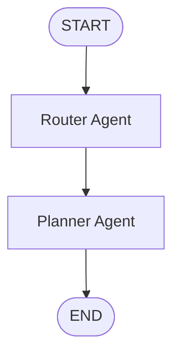

# Phase P05 — Deterministic LangGraph Agent Runtime

Phase P05 adds a small Agent runtime around the P04 planning service. It uses LangGraph to define
which step runs first, what shared data each step can read, and where execution ends. It does not
use a language model, prompt, external API, database checkpoint, or memory.

## What LangGraph is

LangGraph is a low-level workflow framework. A graph contains:

- **State:** the shared values carried through one run.
- **Nodes:** ordinary Python functions that read state and return updates.
- **Edges:** arrows that define which node runs next.
- **START and END:** special markers for the beginning and end of a run.

The graph must be compiled before it can run. Calling `invoke(initial_state)` starts at `START`,
runs each connected node in order, and returns the final state.

P05 declares direct 1.x dependencies on `langgraph` and `langchain-core`. No model-provider
package such as OpenAI or Qwen is installed.

## Shared state

`app/graphs/state.py` defines `TravelPlanState` as a `TypedDict` with five fields:

| Field | Meaning |
| --- | --- |
| `user_request` | Human-readable text inspected by the Router. |
| `requirements` | The already validated Pydantic `TripRequirements`. |
| `next_agent` | The Router's choice; P05 supports only `"planner"`. |
| `travel_plan` | The final Pydantic `TravelPlan`, or `None` before planning. |
| `error` | A safe explanation when a node cannot continue. |

The declaration uses `total=False`. This does not mean the values are unimportant. It means a node
may return only the fields it changes, which is how LangGraph applies state updates. The API builds
all five initial fields explicitly.

## Nodes

### Router Agent

`app/graphs/nodes/router.py` performs deterministic intent classification. It recognizes simple
planning words such as `plan`, `trip`, `travel`, and `itinerary`, plus several Chinese equivalents.
For inputs such as `plan Tokyo trip` or `Shanghai to Paris travel plan`, it writes:

```python
{"next_agent": "planner", "error": None}
```

There is no LLM call. Empty or unrelated text receives a safe error instead of being guessed as a
planning request.

### Planner Agent

`app/graphs/nodes/planner.py` reads `requirements` only after the Router selected `planner`. It
calls the existing `create_mock_travel_plan()` service and writes the returned `TravelPlan` into
state. Flight selection, hotel selection, itinerary construction, weather, routes, and cost rules
remain in P04; the node does not duplicate them.

## Execution flow



The edge from Router to Planner is deliberately fixed in P05. When the Router rejects an intent,
the Planner node sees that it was not selected, preserves the safe error, and does not call the
planning service. Conditional routing for multiple Agent types belongs to a later phase.

## HTTP endpoint

The new endpoint is:

```text
POST /api/v1/agents/plans
```

The request body is the existing `TripRequirements` model. FastAPI validates it before graph
execution. The endpoint builds a human-readable `user_request`, initializes the five state fields,
calls `travel_planning_graph.invoke()`, and returns the final `TravelPlan`.

Start the application:

```bash
docker compose up -d --wait --wait-timeout 120
uv run uvicorn app.main:app --host 127.0.0.1 --port 8000
```

Then call the Agent endpoint from another terminal:

```bash
curl --noproxy '*' --max-time 10 --fail-with-body --silent --show-error \
  --request POST \
  --header 'Content-Type: application/json' \
  --data '{
    "origin": "Shanghai",
    "destination": "Tokyo",
    "start_date": "2026-09-01",
    "end_date": "2026-09-05",
    "budget": "10000.00",
    "currency": "CNY",
    "travelers": 1,
    "preferences": ["photography", "vintage shopping"]
  }' \
  http://127.0.0.1:8000/api/v1/agents/plans
```

Stop Uvicorn with `Control-C`.

## Tests

The P05 tests use deterministic local code and P02 resource doubles. They do not require a real
LLM, external network, or running Docker services:

```bash
uv run pytest -q tests/graphs tests/api/test_agent_plans.py
uv run ruff check .
uv run ruff format --check .
uv run mypy app
uv run pytest -q
```

## Intentional limitations

- The Router uses fixed keyword matching, not semantic model reasoning.
- The graph has one possible downstream Agent and no conditional edge yet.
- There is no checkpointer, persistence, thread ID, resume, or memory.
- There is no RAG, MCP, SSE, reviewer loop, authentication, or real provider API.
- All returned travel content remains invented deterministic mock data.
