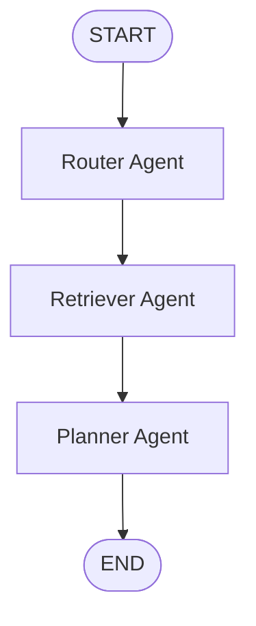

# Phase P06 — Local RAG Pipeline and Retriever Agent

Phase P06 adds local travel knowledge to the Agent workflow without using a real language model or
external travel API. Knowledge comes from four Markdown files in `data/knowledge`, and the existing
Chroma Docker service stores their vectors persistently.

## What RAG means

RAG stands for **Retrieval-Augmented Generation**. Before a Planner creates an answer, a Retriever
searches a knowledge base for relevant text. That text becomes extra context for the planning step.

There is no generative model in this phase. The deterministic P04 planning service still creates
the structured plan. The Planner Agent appends retrieved knowledge to the plan's Markdown so the
data flow is visible and testable without pretending that an LLM reasoned over it.

## Execution flow



`TravelPlanState` now has `retrieved_context: list[str]`. The Retriever writes that field, and the
Planner reads it before returning the final `TravelPlan`.

## Pipeline stages

### 1. Markdown loader

`app/rag/loader.py` reads UTF-8 `.md` files in stable filename order. Each LangChain `Document`
retains metadata such as:

```python
{"source": "tokyo.md", "city": "Tokyo"}
```

The local knowledge files cover Tokyo, Paris, Shanghai, and general travel photography. They are
sample planning context, not live advice or guaranteed current facts.

### 2. Deterministic chunking

`app/rag/splitter.py` uses a fixed 600-character chunk size and 100-character overlap. Every chunk
retains `source` and `city` and receives a stable identifier:

```text
tokyo.md:0000
tokyo.md:0001
```

The same file content and settings always produce the same chunks and IDs.

### 3. Local embedding

`app/rag/embeddings.py` defines the small `EmbeddingModel` interface:

```python
embed_documents(texts)
embed_query(text)
```

P06 uses `DeterministicHashEmbedding`, an offline normalized bag-of-words hash vector. It needs no
API key, model server, model download, network, or randomness. A sentence-transformers model was
preferred by the phase prompt but was not added because its weights are normally downloaded
separately and would make the required indexing verification dependent on a large external
artifact. The hash model is less semantically capable; that is an intentional current limitation.

### 4. Chroma vector store

`app/rag/vector_store.py` uses the existing `chromadb-client` dependency and Chroma Docker service.
It opens or creates the persistent collection:

```text
travel_knowledge
```

Indexing uses Chroma's current `upsert()` API with each `chunk_id` as its record ID. Running the
indexer repeatedly updates the same records rather than creating duplicates. Search passes a local
query embedding to Chroma's similarity `query()` API.

The implementation never calls Chroma `reset()`, never deletes a collection, and never removes the
`chroma_data` named volume. Chroma calls have safe errors and a caller-visible deadline based on
`infrastructure_timeout_seconds`.

### 5. Retriever Agent

`app/graphs/nodes/retriever.py` reads `user_request`, calls the RAG retriever, and writes the
matching text into `retrieved_context`. A retrieval failure becomes a safe state error instead of
returning an internal Chroma exception or traceback.

The graph factory accepts an injected retrieval callable. The real application uses Chroma;
ordinary tests inject deterministic in-memory fakes, so normal pytest never requires Docker or
network access.

## Index the local knowledge

Start Docker Desktop and the existing services:

```bash
docker compose up -d --wait --wait-timeout 120
```

Run the explicit indexer from the repository root:

```bash
uv run python scripts/index_knowledge.py
```

A successful run reports how many chunks from the four Markdown files were upserted into
`travel_knowledge`. Indexing never runs during import or FastAPI startup.

Then start the API:

```bash
uv run uvicorn app.main:app --host 127.0.0.1 --port 8000
```

Call the existing Agent endpoint:

```bash
curl --noproxy '*' --max-time 10 --fail-with-body --silent --show-error \
  --request POST \
  --header 'Content-Type: application/json' \
  --data '{
    "origin": "Shanghai",
    "destination": "Tokyo",
    "start_date": "2026-09-01",
    "end_date": "2026-09-05",
    "budget": "10000.00",
    "currency": "CNY",
    "travelers": 1,
    "preferences": ["photography"]
  }' \
  http://127.0.0.1:8000/api/v1/agents/plans
```

The response remains a `TravelPlan`. Its `markdown` field contains a
`## Retrieved travel knowledge` section when Chroma returns context.

## Tests

Pure tests do not connect to Chroma:

```bash
uv run pytest -q tests/rag tests/graphs tests/api/test_agent_plans.py
uv run ruff check .
uv run ruff format --check .
uv run mypy app
uv run pytest -q
```

The real Chroma check is intentionally explicit:

```bash
docker compose ps
uv run python scripts/index_knowledge.py
```

## Current limitations

- Hash embeddings recognize shared words but do not understand language like a trained semantic
  model.
- There is no multi-query expansion, BM25 hybrid search, reciprocal-rank fusion, reranker, or
  parent-document mapping.
- Retrieved context is appended to Markdown; it does not reorder the deterministic P04 itinerary.
- If a source file becomes shorter, upsert updates current IDs but intentionally does not delete
  older higher-numbered chunks because this phase forbids deletion.
- Chroma's official sync HTTP client 1.5.9 configures its internal httpx session with no timeout.
  The adapter returns after its own deadline, but an already-running background client thread
  cannot be forcefully stopped by Python.
- There is no MCP, memory, SSE, real LLM, authentication, frontend, or real travel API.
