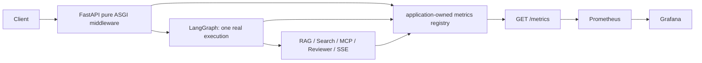

# Phase P13 — Observability, Prometheus, and Grafana

## Beginner overview

Observability answers three practical questions: “what is the application doing?”, “how often is
it succeeding?”, and “where did a safe failure occur?”. P13 adds three views of the same running
program:

- Loguru writes one compact JSON object per important event.
- `prometheus-client` keeps numeric counters, gauges, and histograms in this Python process.
- Prometheus reads `/metrics`; Grafana draws the provisioned dashboard from Prometheus data.

This does not add an LLM, real travel inventory, production tracing, authentication, or alerting.



## Safe structured logs

Loguru is configured during FastAPI startup and flushed/removed during shutdown. Because Loguru's
logger is process-wide, overlapping app lifespans with the same level and output share one
reference-counted sink; closing one lease cannot remove the sink while another app remains active.
An overlapping app with a conflicting Loguru configuration fails explicitly instead of silently
replacing the active sink. Logs are UTC, one-line JSON on standard error. Public fields are limited
to:

`timestamp`, `level`, `event`, `message`, `request_id`, `method`, `route`, `status_code`,
`duration_ms`, `component`, `backend_mode`, `node`, `search_kind`, `tool`, `review_round`, `outcome`,
`error_code`, `thread_ref`, and `user_ref`.

Missing fields are omitted. Request bodies, preferences, plans, retrieved context, tool payloads,
Authorization/Cookie headers, passwords, tokens, API keys, DSNs, Redis URLs, raw exceptions, and
tracebacks are not public log fields. `diagnose` and `backtrace` are disabled.

Example using invented values:

```json
{"timestamp":"2026-08-19T08:00:00+00:00","level":"INFO","message":"HTTP response lifecycle completed.","event":"http_request_completed","request_id":"demo-request-1","method":"GET","route":"/health","status_code":200,"duration_ms":1.25,"component":"http","outcome":"completed"}
```

Raw `user_id` and `thread_id` are never logged. When correlation is useful, a fixed one-way digest
creates `usr_...` and `thr_...` references. This is **pseudonymization, not anonymization**: someone
who already knows the input may still test guesses. These references therefore remain internal
logs and never become Prometheus labels.

## Request ID and HTTP lifecycle

The outer pure ASGI middleware accepts `X-Request-ID` only when it is 1–64 safe characters
(`A-Z`, `a-z`, digits, dot, underscore, colon, or hyphen). Otherwise it generates a UUID. The value
is stored in a ContextVar, so concurrent async requests do not overwrite one another, and is
returned on every response as `X-Request-ID`.

The middleware times until the final `http.response.body`, not merely the response headers. This
means StreamingResponse and SSE duration includes the complete connection. It does not read or
cache request bodies. Route metrics use FastAPI templates such as
`/api/v1/agents/threads/{thread_id}/plans`; unmatched paths use `unmatched`. `/metrics` is excluded
from ordinary HTTP metrics so every Prometheus scrape does not create more scrape traffic data.

## Registry and `/metrics`

Every `create_app()` call creates an independent `CollectorRegistry`, avoiding duplicate
timeseries during tests. The running app also registers normal Python GC, platform, and process
collectors. `GET /metrics`:

- returns Prometheus text with `text/plain; version=1.0.0; charset=utf-8`;
- has no redirect and is omitted from OpenAPI;
- only reads memory and never probes PostgreSQL, Redis, Chroma, or MCP;
- contains no request ID, user/thread ID, city, natural-language query, or secret.

P13 supports one Uvicorn worker. It does not configure Prometheus Python multiprocess mode, so
multi-worker totals would be incomplete.

## Metrics reference

| Metric | Type | Labels |
|---|---|---|
| `travel_planner_http_requests_total` | Counter | `method`, `route`, `status_code` |
| `travel_planner_http_request_duration_seconds` | Histogram | `method`, `route` |
| `travel_planner_http_requests_in_progress` | Gauge | `method` |
| `travel_planner_graph_runs_total` | Counter | `backend`, `status` |
| `travel_planner_graph_run_duration_seconds` | Histogram | `backend`, `status` |
| `travel_planner_graph_node_duration_seconds` | Histogram | `node`, `status` |
| `travel_planner_review_rounds` | Histogram | `final_status` |
| `travel_planner_plan_finalizations_total` | Counter | `review_status`, `reason` |
| `travel_planner_rag_searches_total` | Counter | `status`, `cache_status` |
| `travel_planner_rag_search_duration_seconds` | Histogram | `status` |
| `travel_planner_rag_contexts_returned` | Histogram | none |
| `travel_planner_rag_cache_events_total` | Counter | `cache_status` |
| `travel_planner_search_tasks_total` | Counter | `kind`, `backend`, `status` |
| `travel_planner_search_task_duration_seconds` | Histogram | `kind`, `backend`, `status` |
| `travel_planner_mcp_tool_calls_total` | Counter | `tool`, `status` |
| `travel_planner_mcp_tool_duration_seconds` | Histogram | `tool`, `status` |
| `travel_planner_sse_connections_active` | Gauge | none |
| `travel_planner_sse_connections_total` | Counter | `terminal_status` |
| `travel_planner_sse_connection_duration_seconds` | Histogram | `terminal_status` |
| `travel_planner_sse_events_total` | Counter | `event_type` |
| `travel_planner_sse_disconnects_total` | Counter | none |
| `travel_planner_dependency_ready` | Gauge | `dependency` |

All label values pass fixed allowlists. Unknown backend, node, status, search kind, MCP tool, SSE
event, or dependency becomes `unknown`; arbitrary input is never copied. Request/user/thread IDs,
origin, destination, query, error message, exception class, flight/hotel names, and raw URL paths are
forbidden labels.

## Instrumentation semantics

- Graph runs are wrapped at the existing API `ainvoke()` and SSE `astream()` boundary. The wrapper
  accepts a callable but invokes it exactly once. P12 checkpoint fallback remains `aget_state()`;
  it never re-runs the graph.
- Node wrappers use `functools.wraps`, support sync/async nodes, retain Runtime injection, and do not
  inspect node input/output beyond the existing safe `error` field.
- Five Search wrappers surround the five independent operations. They introduce no shared lock,
  `gather`, ordering, or serialization, so LangGraph `Send` concurrency remains unchanged.
- RAG records only cache status, status, duration, and context count. Redis degradation stays a
  real `unavailable` outcome; queries, keys, and context are absent.
- MCP counts one logical tool call after its existing bounded retry policy, separately from the
  domain Search metric. Tool names come from the five-name allowlist.
- Reviewer rounds and finalization use the actual graph state. No score or critique is fabricated
  or copied into labels.
- SSE increments active at connection start and decrements in `finally`. Its terminal status is
  `success`, `error`, `disconnect`, or `cancelled`; success/error is committed only after the
  downstream response asks for the item after the terminal event, so a failed terminal-event send
  remains a disconnect. The standard `: ping` heartbeat comment is not a business event and
  consumes neither an event ID nor a metric event count.
- Dependency gauges update only after a real readiness request. Scraping `/metrics` triggers no
  dependency call.

## Prometheus and Grafana local profile

Docker Desktop must be running. Start FastAPI on the host first, because Prometheus scrapes
`host.docker.internal:8000`:

```bash
uv run uvicorn app.main:app --host 127.0.0.1 --port 8000 --no-access-log
docker compose --profile observability up -d --wait --wait-timeout 180
```

The ordinary `docker compose up -d` still starts only PostgreSQL, Redis, and Chroma. The explicit
profile adds official fixed images `prom/prometheus:v3.14.0` and `grafana/grafana:13.1.3`, plus
`prometheus_data` and `grafana_data`. Prometheus retains seven days. Configuration mounts are
read-only. Both published ports are loopback only:

- Prometheus: `http://127.0.0.1:9090`
- Grafana: `http://127.0.0.1:3000`

Grafana provisions datasource UID `travel-planner-prometheus` and dashboard UID
`travel-planner-overview`. Anonymous access is Viewer-only, signup/basic login are disabled, and
there is no repository password. This is a local demo with no TLS or real authentication; never
publish port 3000.

Validate and inspect:

```bash
docker compose config
docker compose --profile observability config
docker compose --profile observability ps
docker compose --profile observability logs prometheus grafana
uv run python scripts/check_observability.py
```

Stop only the optional services while retaining every named volume:

```bash
docker compose --profile observability stop prometheus grafana
```

Never use `docker compose down -v` for ordinary stopping; `-v` deletes named-volume data.

## Provisioned dashboard panels

The file-provisioned dashboard started with 20 P13 panels: HTTP request rate, HTTP error rate,
HTTP p50/p95/p99 latency, HTTP in-progress, graph run rate, graph outcomes, graph p95, node p95,
review rounds, finalization outcome, RAG cache outcomes, RAG latency, Search task status, Search
p95, MCP tool status, MCP p95, active SSE connections, SSE terminal outcomes, SSE disconnects, and
dependency readiness. P14 appends four panels without changing those originals: LLM requests,
LLM error rate, LLM p95 duration, and provider-reported token usage. Histogram panels use
`histogram_quantile()` over rate-of-buckets grouped by
`le`. Empty data remains empty rather than being presented as success.

P15 appends four more panels without changing the earlier 24: intake turns by bounded outcome,
the first deterministic clarification field, explicit confirmation outcomes, and the p95 duration
of LLM requests whose fixed role is `intake`. User, thread, message, destination, and preference
values are never metric labels.

## Tests and full E2E

Ordinary offline checks need no Docker or network:

```bash
uv run pytest -q
```

Existing integration tests collectively cover PostgreSQL checkpoint restart/recovery, explicit
preference memory, advanced RAG cache miss→hit, five-way Search, direct/MCP backends, reviewer
revise/accepted/forced-finalize, and SSE terminal behavior. The P13 live E2E additionally verifies
the running API, request IDs, persistence/state/history, memory in a new thread, Advanced RAG,
SSE, metric growth/privacy, Prometheus target/query, and Grafana provisioning:

```bash
RUN_INTEGRATION_TESTS=1 uv run pytest -m integration -q
RUN_OBSERVABILITY_TESTS=1 uv run pytest -m observability -q
```

Every live P13 identifier begins with a unique `p13-` prefix. Cleanup deletes only those exact
checkpoints and preferences. Tests never DROP/TRUNCATE databases, flush Redis, or reset Chroma.

## Troubleshooting and limitations

- Prometheus target DOWN: first confirm FastAPI listens on host port 8000, then open
  `http://127.0.0.1:8000/metrics`; on Linux confirm the Compose `host-gateway` mapping works.
- Grafana has no dashboard: inspect `docker compose --profile observability logs grafana` and check
  that both provisioning directories are mounted read-only.
- No dependency series: call `/ready`; scrape itself intentionally performs no probes.
- No RAG series: prepare the P10 local model/index explicitly; startup never downloads a model.
- Metrics disappear after restart: counters are process memory. Prometheus retains previously
  scraped samples, but the new Python process begins at zero.

P13 is local development observability, not production deployment. There is no real LLM tracing,
LangSmith, real travel inventory, public Grafana, multi-worker aggregation, authentication, TLS,
alerting, or on-call system, and P14 is not implemented here.
